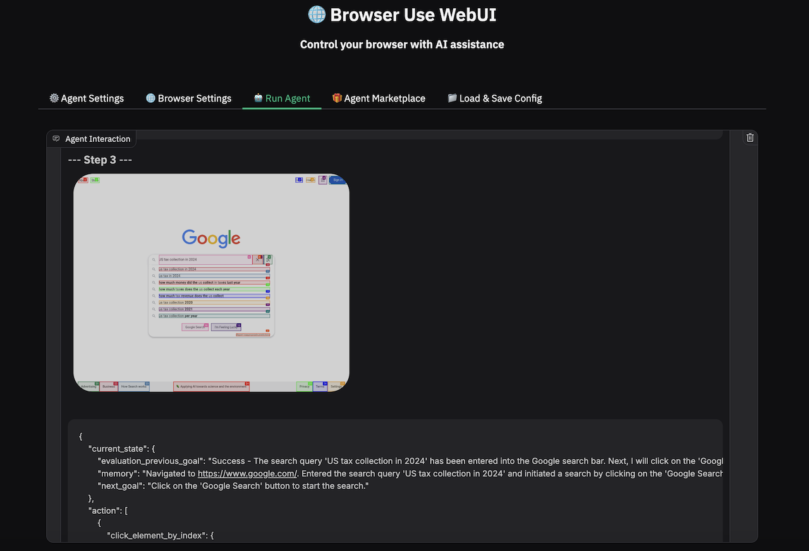
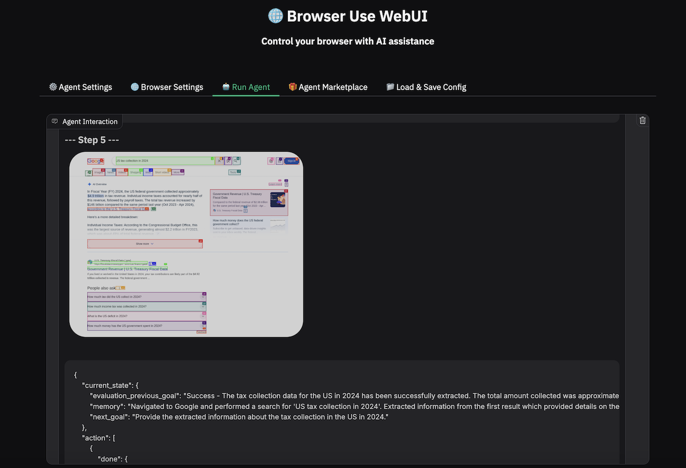

# Run Browser Use AI Agent on a Bare Metal Server in Minutes (Fully Automated)

This guide walks you through setting up AI Agent on your own bare metal server in just minutes. You'll launch:

- A bare metal server with Nvidia GPUs running **Sbnb Linux**
- A **VM with Ubuntu 24.04**
- The open-source [**Browser Use AI Agent**](https://github.com/browser-use/web-ui) project
- Ask AI Agent question to find an answer in automated mode using web browser

---

## How Does an AI Agent Compare to RAG?

In a separate how-to (https://github.com/sbnb-io/sbnb/edit/main/README-LightRAG.md), we manually searched for information on the internet and uploaded it into RAG for processing.
In contrast, an AI Agent skips this manual step and autonomously finds the required information for us.

For example, we asked the same question used in the RAG example - "How much tax was collected in the US in 2024?"
The AI Agent opened a new browser tab, visited google.com, and searched for "US tax collection in 2024" as shown in the following screenshot:



Then, the AI Agent analyzed the results and prepared a final answer, as shown in the next screenshot:



---

## Why Run AI Agent on Your Own Bare Metal Server?

### Privacy & Security
- Full control over your data - nothing leaves your server
- Ideal for **sensitive or regulated data** (e.g., healthcare, finance, legal)
- Compliant with **data sovereignty** requirements (e.g., store and process data within specific countries or jurisdictions)
- No vendor lock-in - run everything locally or in your own cloud

### Cost Efficiency
- No pay-per-call fees
- Predictable, one-time hardware investment

---

## Prerequisites

- Boot Bare Metal server into Sbnb Linux. Read more at [README-INSTALL.md](README-INSTALL.md).
- One or more Nvidia GPUs attached to the Bare Metal server
- Laptop with [Tailscale](https://tailscale.com/) configured to access the bare metal server for configuration.

---

## Step-by-Step Setup

### 1. Boot Bare Metal Server into Sbnb Linux

Follow [README-INSTALL.md](README-INSTALL.md) to boot your server into Sbnb Linux. After boot, verify it appears in your **Tailscale machine list**:


See [README-SERIAL-NUMBER.md](README-SERIAL-NUMBER.md) for automatic hostname assignment.

---

### 2. Connect Your Laptop to Tailscale and Install Ansible

Connect your laptop to the same Tailscale network as your server using the instructions at [https://tailscale.com/](https://tailscale.com/). This allows your laptop to directly reach your server using SSH, which is the primary transport protocol used by Ansible automation.

We use a MacBook in this tutorial, but any Linux/Unix laptop should work.
To install Ansible on macOS using Homebrew:

```sh
brew install ansible
```
---

At this point, your network should resemble the diagram below - with both your laptop and server able to communicate directly over the Tailscale network.


### Warning: Run All Commands From Your Laptop

All commands below should be executed on your **laptop**, not the server.

---

### 3. Clone the Sbnb Repository

```sh
git clone https://github.com/sbnb-io/sbnb.git
cd sbnb
```

---

### 4. Start a VM with GPU Passthrough

```sh
ansible-playbook -i sbnb-F6S0R8000719, \
  collections/ansible_collections/sbnb/compute/playbooks/start-vm.yml \
  -e sbnb_vm_tskey="tskey-auth-xxxxx" \
  -e sbnb_vm_attach_gpus=true \
  -e sbnb_vm_vcpu=8 \
  -e sbnb_vm_mem=16G \
  -e sbnb_vm_image_size=100G
```

Replace `sbnb-F6S0R8000719` with your server's Tailscale hostname and `tskey-auth-xxxxx` with your Tailscale auth key.

You should see the VM appear in Tailscale as `sbnb-vm-<VMID>` (e.g., `sbnb-vm-67f97659333f`).

> All Nvidia GPUs will be attached using vfio-pci.


---

### 5. Install Docker and NVIDIA Drivers in the VM

```sh
export VM_HOST=sbnb-vm-67f97659333f

ansible-playbook -i $VM_HOST, \
  collections/ansible_collections/sbnb/compute/playbooks/install-docker.yml

ansible-playbook -i $VM_HOST, \
  collections/ansible_collections/sbnb/compute/playbooks/install-nvidia.yml
```

---

At this point, you have a VM running **Ubuntu 24.04** with **Nvidia GPU** attached.

---

## Run Browser Use AI Agent

```sh
ansible-playbook -i $VM_HOST, \
  collections/ansible_collections/sbnb/compute/playbooks/run-browser-use.yml
```

This command will:

- Start the Ollama serving engine
- Download default LLM model for Browser Use AI Agent ("qwen2.5:7b")
- Launch Browser Use AI Agent

**Browser Use AI Agent is up!**

---

## Using Browser Use AI Agent

### 1. Access the Web UI to control AI Agent

Navigate to the VM hostname via Tailscale, using port `7788`. Example URL:

```
http://sbnb-vm-67f97659333f:7788/
```

### 2. Access the VNC Graphic Interface to Watch Browser Interactions

Navigate to the VM hostname via Tailscale, using the following example URL:
```
http://sbnb-vm-67f97659333f:6080/vnc.html
```

(Default VNC password: `youvncpassword`)

---

### 3. Start Working with the AI Agent

In the AI Agent Web UI, navigate to the `Run Agent` section and ask:

> "How much tax was collected in the US in 2024?"

After accessing the internet and processing the data, the AI Agent responds with the answer:
```
Task Completed

Duration: 46.31 seconds
Total Input Tokens: 22291
Final Result: The US federal government collected approximately $4.9 trillion in tax revenue in fiscal year 2024, with individual income taxes accounting for nearly half of this revenue ($2.2 trillion or 49%) and payroll taxes contributing $1.73 trillion (35%). The total tax revenue increased by $146 billion compared to the same period last year (Oct 2023 - Apr 2024), according to the U.S. Treasury Fiscal Data.
Status: Success
```

You can monitor the AI Agent's actions in the VNC Web interface.

Below is an animated GIF showing all the steps taken by the AI Agent in autonomous mode.


---

## Stopping Services

To stop Browser Use AI Agent:
```sh
ansible-playbook -i $VM_HOST, \
  collections/ansible_collections/sbnb/compute/playbooks/run-browser-use.yml \
  -e sbnb_browser_use_state=absent
```

---

**That's it!** You've successfully run the AI Agent to find the necessary information in autonomous mode.
This is just a basic example, but the possibilities unlocked by AI Agents are enormous.

Be sure to follow the amazing [Browser Use](https://github.com/browser-use/web-ui) project for more use cases and examples!

Happy experimenting - and solving real-world problems!
