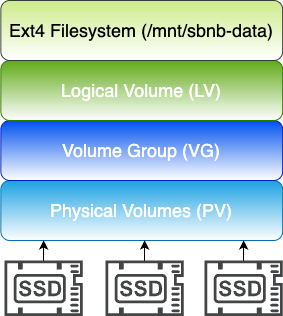
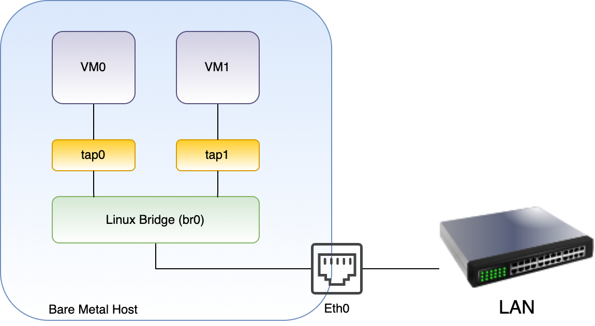

# README-CONFIGURE_SYSTEM.md

## Overview

Sbnb Linux boots a bare-metal server into a baseline usable state. In this state, the bare-metal server is accessible via SSH over a WireGuard tunnel (Tailscale). Once connected, further configuration can be performed remotely using automation tools. Ansible has been chosen as a simple, stable, and widely used solution.

## Sbnb Linux Lifetime Stages

### **Stage 1:** Boot Bare Metal Server
- The server boots from a USB flash drive into a minimalist in-memory environment.
- It acquires an IP address via DHCP.
- Establishes a WireGuard tunnel (Tailscale).
- Ready to receive commands over SSH.

### **Stage 2:** Automated Configuration
The automation system configures the server by executing specific tasks:

#### **Networking**
- The current implementation creates a bridge interface (`br0`) and attaches the main network interface to it.
- Advanced networking configurations such as `vfio-pci`, `ROCE`, or `Infiniband` can be implemented through this staged approach.

#### **Storage (Disks)**
- Finds all drives without existing partitions.
- Allocates 100% free space to LVM.
- Combines all available drives into a single flat space (similar to RAID0).
- Creates Physical Volume (PV), Volume Group (VG), and Logical Volume (LV).
- Formats the LV to `ext4` and mounts it at `/mnt/sbnb-data`.

This staged approach enables scalable configurations, from small test labs to massive AI training data centers.

---

## Step-by-Step Guide

### **1. Boot Bare Metal Server into Sbnb Linux**
Follow the instructions in [README-INSTALL.md](README-INSTALL.md). After booting, ensure the server appears in your **Tailscale machine list**.

### **2. Connect Your Laptop to Tailscale**
This guide assumes a MacBook, but any Linux-based machine will work similarly.

### **3. Download Tailscale Dynamic Inventory Script**
```sh
curl https://raw.githubusercontent.com/m4wh6k/ansible-tailscale-inventory/refs/heads/main/ansible_tailscale_inventory.py -O
chmod +x ansible_tailscale_inventory.py
```

### **4. Pull Ansible Playbook**
```sh
curl -O https://raw.githubusercontent.com/sbnb-io/sbnb/refs/heads/main/automation/sbnb-configure-system.yaml
```

Under the hood, the Ansible playbook executes three scripts, [sbnb-configure-storage.sh](https://github.com/sbnb-io/sbnb/blob/main/scripts/sbnb-configure-storage.sh), [sbnb-configure-networking.sh](https://github.com/sbnb-io/sbnb/blob/main/scripts/sbnb-configure-networking.sh), and [sbnb-configure-system.sh](https://github.com/sbnb-io/sbnb/blob/main/scripts/sbnb-configure-system.sh) for those interested in a deeper dive.

### **5. Set Environment Variables**
```sh
export SBNB_HOSTS=sbnb-F6S0R8000719
```
Replace `sbnb-F6S0R8000719` to your hostname.

### **6. Run Ansible Playbook**
```sh
ansible-playbook -i ./ansible_tailscale_inventory.py sbnb-configure-system.yaml
```

**Congratulations!** Your storage and network configurations are now automated!

---

## Example

### **Initial Server State**
A 1U rack server with three 512GB SATA SSDs and a standard Ethernet connection.

#### **Disks Before Configuration**
```sh
# lsblk
NAME   MAJ:MIN RM   SIZE RO TYPE MOUNTPOINTS
sda      8:0    0 476.9G  0 disk
sdb      8:16   0 476.9G  0 disk
sdc      8:32   0 476.9G  0 disk
```

#### **Network Before Configuration**
```sh
# ip addr
2: enp67s0f0np0: <BROADCAST,MULTICAST,UP,LOWER_UP> mtu 1500 qdisc mq qlen 1000
    link/ether d0:50:99:ff:f2:e2 brd ff:ff:ff:ff:ff:ff
    inet 192.168.40.5/24 brd 192.168.40.255 scope global dynamic enp67s0f0np0
       valid_lft 42481sec preferred_lft 42481sec
    inet6 fe80::d250:99ff:feff:f2e2/64 scope link
       valid_lft forever preferred_lft forever
```

### **Post-Configuration Server State**
The disks are combined into an LVM volume, formatted as `ext4`, and mounted at `/mnt/sbnb-data`.

#### **Disks After Running Ansible Playbook**




```sh
# lsblk
NAME                MAJ:MIN RM   SIZE RO TYPE MOUNTPOINTS
sda                   8:0    0 476.9G  0 disk
`-sbnb--vg-sbnb--lv 253:0    0   1.4T  0 lvm  /mnt/sbnb-data
sdb                   8:16   0 476.9G  0 disk
`-sbnb--vg-sbnb--lv 253:0    0   1.4T  0 lvm  /mnt/sbnb-data
sdc                   8:32   0 476.9G  0 disk
`-sbnb--vg-sbnb--lv 253:0    0   1.4T  0 lvm  /mnt/sbnb-data

# df -h
/dev/mapper/sbnb--vg-sbnb--lv 1.4T      2.3M      1.4T   0% /mnt/sbnb-data
```


#### **Network After Running Ansible Playbook**



The main Ethernet interface is attached to a Linux bridge (`br0`).
```sh
# ip addr
2: enp67s0f0np0: <BROADCAST,MULTICAST,UP,LOWER_UP> mtu 1500 qdisc mq master br0 qlen 1000
    link/ether d0:50:99:ff:f2:e2 brd ff:ff:ff:ff:ff:ff

7: br0: <BROADCAST,MULTICAST,UP,LOWER_UP> mtu 1500 qdisc noqueue qlen 1000
    link/ether 2a:9d:ef:86:3b:78 brd ff:ff:ff:ff:ff:ff
    inet 192.168.40.137/24 brd 192.168.40.255 scope global dynamic br0
       valid_lft 42943sec preferred_lft 42943sec
    inet6 fe80::289d:efff:fe86:3b78/64 scope link
       valid_lft forever preferred_lft forever
```


This setup allows virtual machines to connect directly to the LAN via `br0`.

