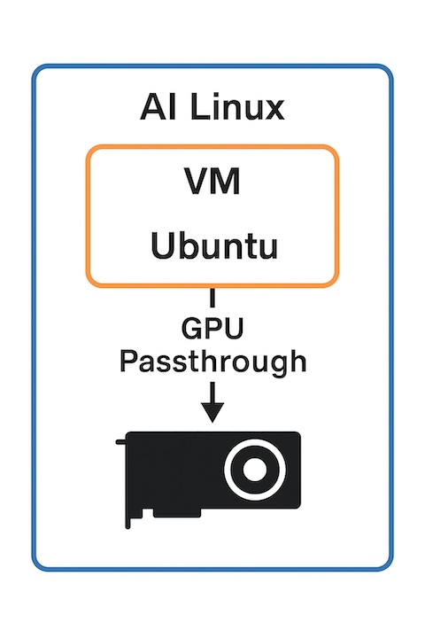

# Measuring GPU Passthrough Overhead Using vfio-pci on AI Linux

In this article, we measure the performance penalty introduced by GPU passthrough using the standard Linux mechanism `vfio-pci`. The test setup uses AMD RX 9060 XT 16GB and runs LLM benchmarks via [Ollama](https://ollama.com/) to compare bare metal vs. VM performance.

## Test Setup

- **GPU:** AMD RX 9060 XT 16GB  
- **Bare Metal OS:** Ubuntu 24.04 Server  
- **VM OS:** Ubuntu 24.04 Cloud Image running under AI Linux (Sbnb Linux) with `vfio-pci` GPU passthrough  
- **LLM Models Tested (fit within 16GB VRAM):**
  - `mistral:7b`
  - `gemma2:9b`
  - `phi4:14b`
  - `deepseek-r1:14b`

## GPU Passthrough Architecture

Here is a simplified diagram showing how GPU passthrough works using `vfio-pci` with AI Linux and a VM running Ubuntu:



### ROCm Installation

AMD ROCm drivers and tools were installed following the [official quick start guide](https://rocm.docs.amd.com/projects/install-on-linux/en/latest/install/quick-start.html) using the steps below:

```bash
wget https://repo.radeon.com/amdgpu-install/6.4.1/ubuntu/noble/amdgpu-install_6.4.60401-1_all.deb
sudo apt install -y ./amdgpu-install_6.4.60401-1_all.deb
sudo apt update -y
sudo apt install -y "linux-headers-$(uname -r)" "linux-modules-extra-$(uname -r)"
sudo apt install -y amdgpu-dkms

sudo apt install -y python3-setuptools python3-wheel
sudo usermod -a -G render,video $LOGNAME
sudo apt install -y rocm

sudo tee --append /etc/ld.so.conf.d/rocm.conf <<EOF
/opt/rocm/lib
/opt/rocm/lib64
EOF
sudo ldconfig

modprobe amdgpu
```

### How We Ran the Benchmarks

To run the benchmarks, we used the following setup commands:

```bash
apt install -y python3-venv
python3 -m venv ollama-benchmark
cd ollama-benchmark/
. bin/activate

pip install llm-benchmark

cat > benchmarks.yml << EOF
version: 2.0
models:
  - model: mistral:7b
  - model: gemma2:9b
  - model: phi4:14b
  - model: deepseek-r1:14b
EOF

# install ollama
curl -fsSL https://ollama.com/install.sh | sh

llm_benchmark run --custombenchmark=benchmarks.yml
```

---

## Benchmark Results (tokens per second)

| Model             | Bare Metal | VM w/ GPU Passthrough | Penalty (%) |
|------------------|------------|-------------------|-------------|
| mistral:7b       | 50.10      | 49.27             | 1.66%       |
| gemma2:9b        | 35.06      | 34.96             | 0.29%       |
| phi4:14b         | 27.52      | 27.20             | 1.16%       |
| deepseek-r1:14b  | 25.10      | 24.67             | 1.71%       |

---

## Conclusion

The performance impact of GPU passthrough via `vfio-pci` in AI Linux (Sbnb Linux) is impressively low-averaging around 1-2% across a range of LLM models. This makes it a highly viable option for running accelerated inference inside virtual machines, enabling isolation and flexibility without compromising performance.

---
