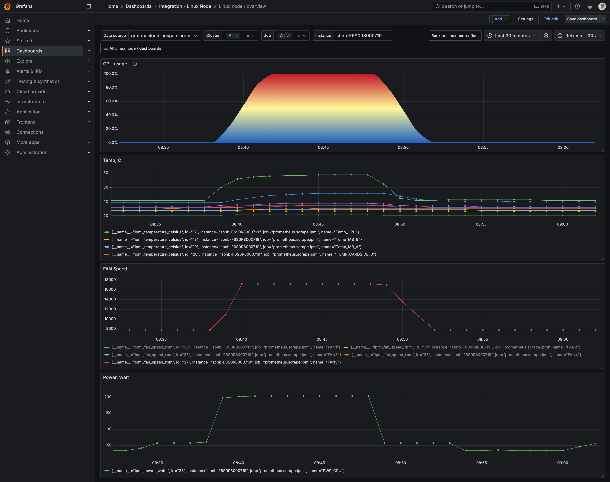
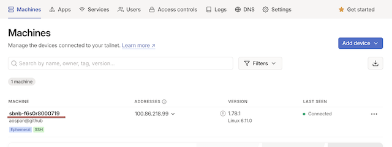

# Run Grafana Monitoring under Sbnb Linux

This tutorial will show how to get a Bare Metal server up & running with CPU Temperature, Fan speed, and Power consumption (Watt) monitoring using Grafana in minutes with Sbnb Linux. At the end, you will be able to see the following monitoring graphs from your Bare Metal server. The graph below shows a CPU stress test for 10 minutes, leading to a CPU load spike to 100%, a temperature rise from 40°C to around 80°C, a Fan speed increase from 8000 RPM to 18000 RPM, and power consumption rising from 50 Watts to 200 Watts.



## Prerequisites
- Boot Bare Metal server into Sbnb Linux. Read more at [README-INSTALL.md](README-INSTALL.md).
- Laptop with [Tailscale](https://tailscale.com/) configured to access the bare metal server for configuration.

## Howto

### 1. Boot Bare Metal Server into Sbnb Linux
Boot the Bare Metal server into Sbnb Linux using the instructions in [README-INSTALL.md](README-INSTALL.md). After booting, verify that the server appears in your **Tailscale machine list**.



For more details on automatic hostname assignments, refer to [README-SERIAL-NUMBER.md](README-SERIAL-NUMBER.md).

### 2. Connect Your Laptop to Tailscale
We will use a MacBook in this tutorial, but any machine, such as a Linux instance, should work the same.

### 3. Clone the Sbnb Repository

```sh
git clone https://github.com/sbnb-io/sbnb.git
cd sbnb
```

### 4. Run Monitoring Playbook

Tailscale's Magic DNS allows you to use hostnames directly. Run the monitoring playbook with your Grafana Cloud credentials:

```sh
ansible-playbook -i sbnb-F6S0R8000719, \
  collections/ansible_collections/sbnb/compute/playbooks/run-monitoring.yml \
  -e sbnb_monitoring_grafana_url="https://prometheus-prod-13-prod-us-east-0.grafana.net/api/prom/push" \
  -e sbnb_monitoring_grafana_username="1962802" \
  -e sbnb_monitoring_grafana_password="glc_<YOUR_API_KEY>"
```

Replace:
- `sbnb-F6S0R8000719` with your server's Tailscale hostname
- Grafana credentials with your own, which you can obtain from your Grafana Cloud account under:
  ```
  Home -> Connections -> Data sources -> Your Prometheus Data Source -> Authentication
  ```

The monitoring role automatically detects and starts:
- **Grafana Alloy** - metrics collection and forwarding
- **IPMI Exporter** - if `/dev/ipmi0` exists (CPU temp, fan speed, power)
- **NVIDIA DCGM Exporter** - if `nvidia-smi` is available (GPU metrics)

### 5. Import Grafana Dashboard and Start Monitoring Your Bare Metal Server!
Import [this Grafana dashboard](https://grafana.com/grafana/dashboards/22906-linux-node-overview/) created for simplicity. It displays CPU load and metrics gathered from IPMI, such as various component temperatures, Fan speed, and power consumption in Watts.

### Bonus: Run CPU Stress Test

Run a CPU stress test using sysbench for 10 minutes:

```bash
ansible-playbook -i sbnb-F6S0R8000719, \
  collections/ansible_collections/sbnb/compute/playbooks/run-sysbench.yml
```

As a result, you should see the corresponding graphs in Grafana as shown at the top of this tutorial!

To stop the sysbench stress test:
```bash
ansible-playbook -i sbnb-F6S0R8000719, \
  collections/ansible_collections/sbnb/compute/playbooks/run-sysbench.yml \
  -e sbnb_sysbench_state=absent
```

### Stopping Monitoring

To stop the monitoring containers:
```bash
ansible-playbook -i sbnb-F6S0R8000719, \
  collections/ansible_collections/sbnb/compute/playbooks/run-monitoring.yml \
  -e sbnb_monitoring_state=absent
```
