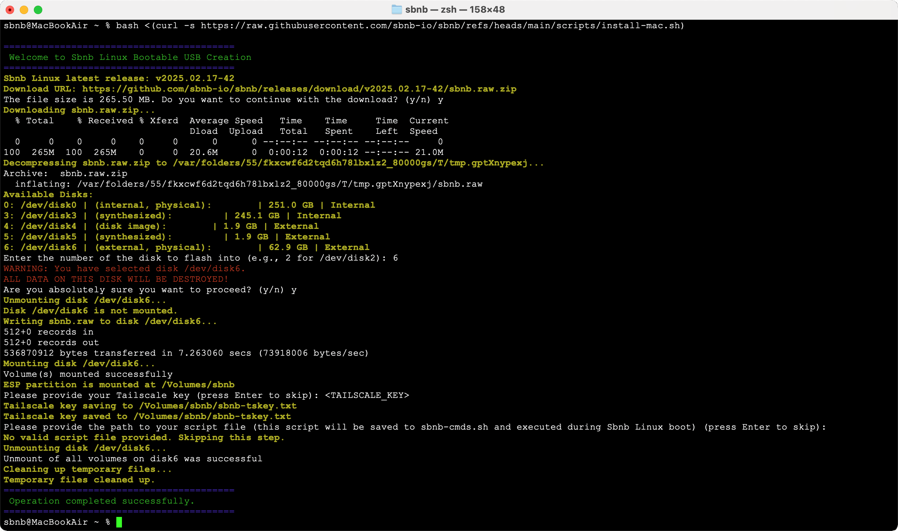
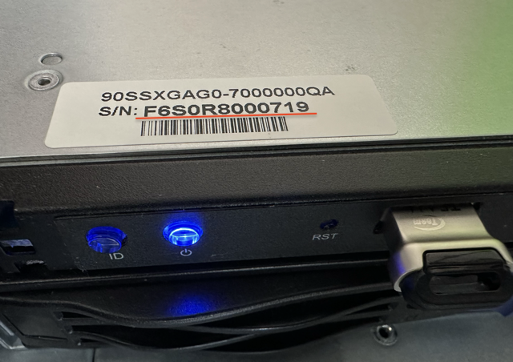

# Install Sbnb Linux

## Prerequisites
- **Bare Metal Server**: Any x86 machine should suffice.
- **USB Flash Drive for Booting**: Any standard USB flash drive with at least 512MB capacity will work.

## Prepare a Bootable USB Dongle with Sbnb Linux
### Attach a USB flash drive to your computer.


### Run the appropriate command below in the terminal:
- **For Windows** (execute in PowerShell as Administrator):
  ```powershell
  iex ((New-Object System.Net.WebClient).DownloadString('https://raw.githubusercontent.com/sbnb-io/sbnb/refs/heads/main/scripts/install-win.ps1'))
  ```

- **For Mac**:
  ```bash
  bash <(curl -s https://raw.githubusercontent.com/sbnb-io/sbnb/refs/heads/main/scripts/install-mac.sh)
  ```

- **For Linux**:
  ```bash
  sh <(curl -s https://raw.githubusercontent.com/sbnb-io/sbnb/refs/heads/main/scripts/install-linux.sh)
  ```

### The script will:
- Download the latest Sbnb Linux image.
- Flash it onto the selected USB drive.
- Prompt you to enter your Tailscale key.
- Allow you to specify custom commands to execute during the Sbnb Linux instance boot.

Here is a screenshot of the script demo running on a Mac:



## Boot the Server
- Attach the prepared USB dongle to the server you want to boot into Sbnb Linux.
- Power on the server.
  



## Notes on Booting the Server
- [Optional] Ensure the USB flash drive is selected as the **first boot device** in your BIOS/UEFI settings. This may be necessary if another operating system is installed or if network boot is enabled.
- The boot process may take **5 to 10 minutes**, depending on your server's BIOS configuration.

## Verify the Server on Tailscale
After booting, verify that the server appears in your **Tailscale machine list**.


## Done!
You can now SSH into the server using Tailscale SSO methods, such as **Google Auth**.

## Next Steps
For development and testing, run the following command after SSH-ing into the server:

```bash
sbnb-dev-env.sh
```
This will transition your environment from the minimalist setup to a full Docker container running Debian/Ubuntu, preloaded with useful development tools.
