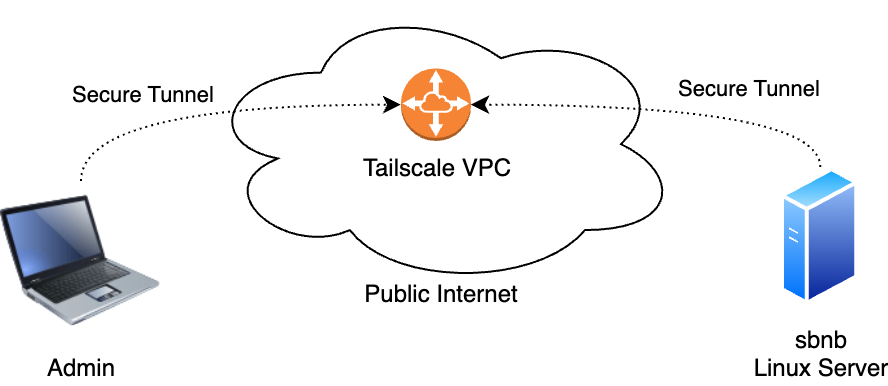
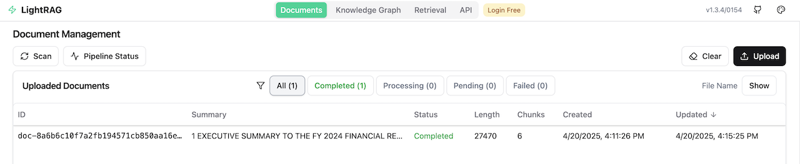
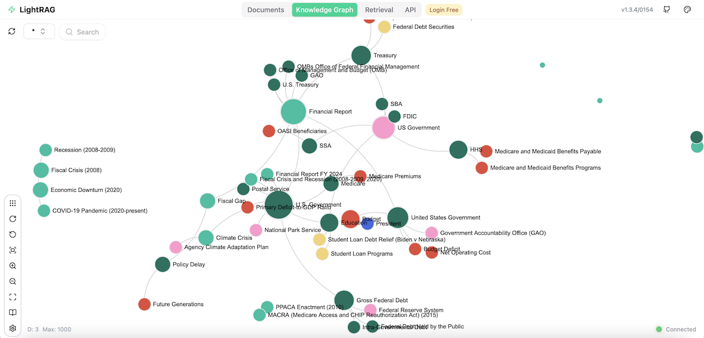
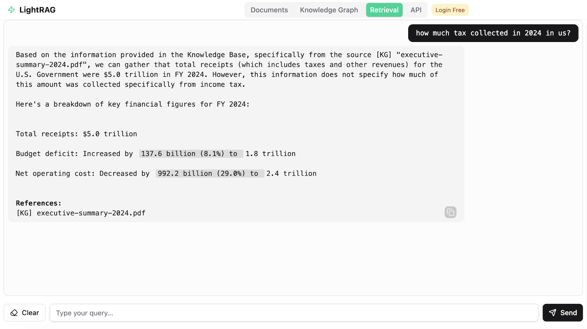

# Run LightRAG on a Bare Metal Server in Minutes (Fully Automated)

* **Note:** We also have a separate guide for running **RAGFlow** using the same approach. Check it out here: [README-RAG.md](README-RAG.md) if you're interested.

This guide walks you through setting up a full RAG pipeline on your own bare metal server in just minutes. You'll launch:

- A bare metal server with Nvidia GPUs running **Sbnb Linux**
- A **VM with Ubuntu 24.04**
- The open-source [**LightRAG**](https://github.com/HKUDS/LightRAG) project
- PDF uploads to LightRAG to extract knowledge

---

## Why Run RAG on Your Own Bare Metal Server?

### Privacy & Security
- Full control over your data - nothing leaves your server
- Ideal for **sensitive or regulated data** (e.g., healthcare, finance, legal)
- Compliant with **data sovereignty** requirements (e.g., store and process data within specific countries or jurisdictions)
- No vendor lock-in - run everything locally or in your own cloud

### Performance
- Faster retrieval and inference

### Cost Efficiency
- No pay-per-call fees
- Predictable, one-time hardware investment

### Customization
- Your own retrievers, embeddings, chunking strategy
- Fine-tuned or quantized LLMs
- Flexible RAG pipelines (filters, rerankers, etc.)

### Offline / Edge Ready
- Fully local operation
- Great for air-gapped or remote deployments

---

## Prerequisites

- Boot Bare Metal server into Sbnb Linux. Read more at [README-INSTALL.md](README-INSTALL.md).
- One or more Nvidia GPUs attached to the Bare Metal server
- Laptop with [Tailscale](https://tailscale.com/) configured to access the bare metal server for configuration.

---

## Step-by-Step Setup

### 1. Boot Bare Metal Server into Sbnb Linux

Follow [README-INSTALL.md](README-INSTALL.md) to boot your server into Sbnb Linux. After boot, verify it appears in your **Tailscale machine list**:


See [README-SERIAL-NUMBER.md](README-SERIAL-NUMBER.md) for automatic hostname assignment.

---

### 2. Connect Your Laptop to Tailscale and Install Ansible

Connect your laptop to the same Tailscale network as your server using the instructions at [https://tailscale.com/](https://tailscale.com/). This allows your laptop to directly reach your server using SSH, which is the primary transport protocol used by Ansible automation.

We use a MacBook in this tutorial, but any Linux/Unix laptop should work.
To install Ansible on macOS using Homebrew:

```sh
brew install ansible
```
---

At this point, your network should resemble the diagram below - with both your laptop and server able to communicate directly over the Tailscale network.



### Warning: Run All Commands From Your Laptop

All commands below should be executed on your **laptop**, not the server.

---

### 3. Clone the Sbnb Repository

```sh
git clone https://github.com/sbnb-io/sbnb.git
cd sbnb
```

---

### 4. Start a VM with GPU Passthrough

```sh
ansible-playbook -i sbnb-F6S0R8000719, \
  collections/ansible_collections/sbnb/compute/playbooks/start-vm.yml \
  -e sbnb_vm_tskey="tskey-auth-xxxxx" \
  -e sbnb_vm_attach_gpus=true \
  -e sbnb_vm_vcpu=8 \
  -e sbnb_vm_mem=16G \
  -e sbnb_vm_image_size=100G
```

Replace `sbnb-F6S0R8000719` with your server's Tailscale hostname and `tskey-auth-xxxxx` with your Tailscale auth key.

You should see the VM appear in Tailscale as `sbnb-vm-<VMID>` (e.g., `sbnb-vm-67f97659333f`).

> All Nvidia GPUs will be attached using vfio-pci.


---

### 5. Install Docker and NVIDIA Drivers in the VM

```sh
export VM_HOST=sbnb-vm-67f97659333f

ansible-playbook -i $VM_HOST, \
  collections/ansible_collections/sbnb/compute/playbooks/install-docker.yml

ansible-playbook -i $VM_HOST, \
  collections/ansible_collections/sbnb/compute/playbooks/install-nvidia.yml
```

---

At this point, you have a VM running **Ubuntu 24.04** with **Nvidia GPU** attached.

---

## Run LightRAG

```bash
ansible-playbook -i $VM_HOST, \
  collections/ansible_collections/sbnb/compute/playbooks/run-lightrag.yml
```

This command will:

- Start the Ollama serving engine
- Download default LLM models for LightRAG ("bge-m3" and "mistral-nemo:latest")
- Launch LightRAG

**LightRAG is up!**

---

## Using LightRAG

### 1. Access the Web UI

Navigate to the VM hostname via Tailscale, using port `8000`. Example URL:

```
http://sbnb-vm-67f97659333f:8000/
```

---

### 2. Upload Documents

For demo purposes, download the latest 2024 US government financial report (latest at the time of writing this tutorial):

[executive-summary-2024.pdf](https://www.fiscal.treasury.gov/files/reports-statements/financial-report/2024/executive-summary-2024.pdf)

Then:

- Navigate to `Documents → Upload`
- Upload the PDF file

Wait until the **Status** reads **Completed**.



---

### 3. Verify data is parsed by checking Knowledge Graph

Navigate to the `Knowledge Graph` menu and confirm that it contains relevant data extracted from the uploaded PDF.



---

### 4. Start Chatting

Navigate to the `Retrieval` section and ask:

> "How much tax was collected in the US in 2024?"

LightRAG responds with the answer **"... $5.0 trillion in FY 2024"** and cites the PDF.



---

## Stopping LightRAG

```sh
ansible-playbook -i $VM_HOST, \
  collections/ansible_collections/sbnb/compute/playbooks/run-lightrag.yml \
  -e sbnb_lightrag_state=absent
```

---

**That's it!** You've successfully combined an LLM with your custom knowledge base.

Happy experimenting—and solving real-world problems!
