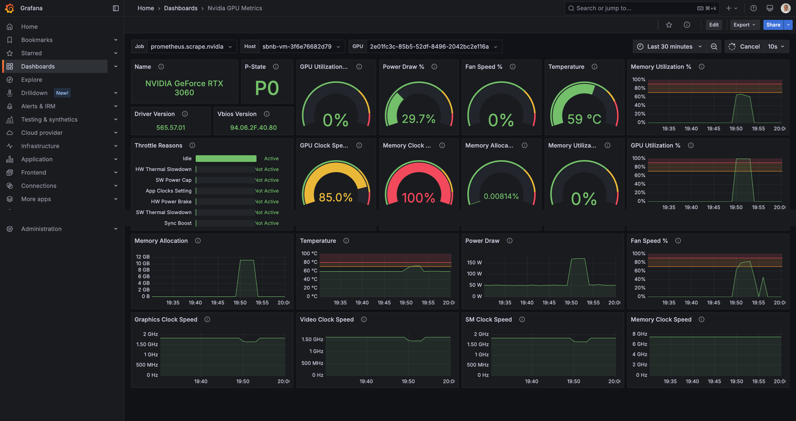

# Run Nvidia GPU Monitoring and Huggingface gpu-fryer under Sbnb Linux in Automated Way

This tutorial will show how to get a Bare Metal server up & running with Nvidia GPU monitoring using NVIDIA DCGM Exporter and Grafana, and run a stress test using Huggingface gpu-fryer in minutes with Sbnb Linux. At the end, you will be able to see the following monitoring graphs from your Bare Metal server. The graph below shows a GPU stress test for a few minutes, leading to a GPU load spike to 100%.



## Prerequisites
- Boot Bare Metal server into Sbnb Linux. Read more at [README-INSTALL.md](README-INSTALL.md).
- One or more Nvidia GPUs attached to the Bare Metal server
- Laptop with [Tailscale](https://tailscale.com/) configured to access the bare metal server for configuration.

## Howto

### 1. Boot Bare Metal Server into Sbnb Linux
Boot the Bare Metal server into Sbnb Linux using the instructions in [README-INSTALL.md](README-INSTALL.md). After booting, verify that the server appears in your **Tailscale machine list**.


For more details on automatic hostname assignments, refer to [README-SERIAL-NUMBER.md](README-SERIAL-NUMBER.md).

### 2. Connect Your Laptop to Tailscale
We will use a MacBook in this tutorial, but any machine, such as a Linux instance, should work the same.

### 3. Clone the Sbnb Repository

```sh
git clone https://github.com/sbnb-io/sbnb.git
cd sbnb
```

### 4. Start a VM with GPU Passthrough

```sh
ansible-playbook -i sbnb-F6S0R8000719, \
  collections/ansible_collections/sbnb/compute/playbooks/start-vm.yml \
  -e sbnb_vm_tskey="tskey-auth-xxxxx" \
  -e sbnb_vm_attach_gpus=true \
  -e sbnb_vm_vcpu=8 \
  -e sbnb_vm_mem=16G \
  -e sbnb_vm_image_size=100G
```

Replace `sbnb-F6S0R8000719` with your server's Tailscale hostname and `tskey-auth-xxxxx` with your Tailscale auth key.

See [README-COLLECTIONS.md](README-COLLECTIONS.md) for all VM options.

Once the VM starts, you should see it appear in the Tailscale network as `sbnb-vm-VMID`. For example, `sbnb-vm-67f97659333f`.

All Nvidia GPUs present in the system will be attached to this VM using a low-overhead vfio-pci mechanism:


### 5. Install Docker and NVIDIA Drivers in the VM

```sh
export VM_HOST=sbnb-vm-67f97659333f

ansible-playbook -i $VM_HOST, \
  collections/ansible_collections/sbnb/compute/playbooks/install-docker.yml

ansible-playbook -i $VM_HOST, \
  collections/ansible_collections/sbnb/compute/playbooks/install-nvidia.yml
```

### 6. Start Monitoring with Grafana Cloud

```sh
ansible-playbook -i $VM_HOST, \
  collections/ansible_collections/sbnb/compute/playbooks/run-monitoring.yml \
  -e sbnb_monitoring_grafana_url="https://prometheus-prod-13-prod-us-east-0.grafana.net/api/prom/push" \
  -e sbnb_monitoring_grafana_username="1962802" \
  -e sbnb_monitoring_grafana_password="glc_<YOUR_API_KEY>"
```

Replace Grafana credentials with your own, which you can obtain from your Grafana Cloud account under:
```
Home -> Connections -> Data sources -> Your Prometheus Data Source -> Authentication
```

The monitoring role automatically starts:
- **Grafana Alloy** - metrics collection and forwarding
- **NVIDIA DCGM Exporter** - GPU metrics (load, memory, temp, power)

### 7. Run GPU Stress Test with gpu-fryer

```sh
ansible-playbook -i $VM_HOST, \
  collections/ansible_collections/sbnb/compute/playbooks/run-gpu-fryer.yml
```

By default, gpu-fryer runs for 60 seconds. To customize the duration:
```sh
ansible-playbook -i $VM_HOST, \
  collections/ansible_collections/sbnb/compute/playbooks/run-gpu-fryer.yml \
  -e sbnb_gpu_fryer_duration=300
```

### 8. Import Grafana Dashboard and Start Monitoring Your GPU!

Import [this Grafana dashboard](https://grafana.com/grafana/dashboards/12239-nvidia-dcgm-exporter-dashboard/) - It displays GPU load and metrics gathered from DCGM, such as memory consumption, temperatures, fan speed, and power consumption in watts.

### Stopping Services

To stop gpu-fryer:
```sh
ansible-playbook -i $VM_HOST, \
  collections/ansible_collections/sbnb/compute/playbooks/run-gpu-fryer.yml \
  -e sbnb_gpu_fryer_state=absent
```

To stop monitoring:
```sh
ansible-playbook -i $VM_HOST, \
  collections/ansible_collections/sbnb/compute/playbooks/run-monitoring.yml \
  -e sbnb_monitoring_state=absent
```
