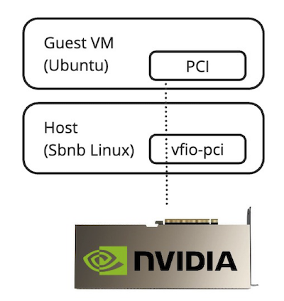

# Use Nvidia GPU within KVM Virtual Machines in PCIe Passthrough Mode with SBNB Linux

## Prerequisites:

- X86 Machine
- Nvidia GPU installed into PCIe slot
- Any USB flash drive

## Desired State

The diagram below depicts the final state after following this tutorial. The Nvidia GPU will be attached to the guest Virtual Machine using the low-overhead `vfio-pci` mechanism.




## Step 1: Prepare a Bootable USB Dongle with SBNB Linux

Attach a USB flash drive to your computer and run the appropriate command below in the terminal:

- **For Windows** (execute in PowerShell as Administrator):
  ```powershell
  iex ((New-Object System.Net.WebClient).DownloadString('https://raw.githubusercontent.com/sbnb-io/sbnb/refs/heads/main/scripts/install-win.ps1'))
  ```

- **For Mac**:
  ```bash
  bash <(curl -s https://raw.githubusercontent.com/sbnb-io/sbnb/refs/heads/main/scripts/install-mac.sh)
  ```

- **For Linux**:
  ```bash
  bash <(curl -s https://raw.githubusercontent.com/sbnb-io/sbnb/refs/heads/main/scripts/install-linux.sh)
  ```

The script will:
- Download the latest Sbnb Linux image.
- Flash it onto the selected USB drive.
- Prompt you to enter your Tailscale key.
- Allow you to specify custom commands to execute during the Sbnb Linux instance boot.

## Step 2: Boot the Server into SBNB Linux

Boot your server using the prepared USB dongle.

## Step 3: SSH to the Server

Verify that the server appears in your Tailscale machine list and SSH into the server using Tailscale SSO methods, such as Google Auth.

## Step 4: Prepare the Environment

Execute `sbnb-dev-env.sh`. This will prepare the full environment with QEMU installed.

## Step 5: Attach Nvidia GPU to vfio-pci

Run the following command to list Nvidia adapters in the system:

```
lspci -nn | grep -i nvidia
```

Example output:

```
c1:00.0 VGA compatible controller [0300]: NVIDIA Corporation GA106 [GeForce RTX 3060 Lite Hash Rate] [10de:2504] (rev a1)
c1:00.1 Audio device [0403]: NVIDIA Corporation GA106 High Definition Audio Controller [10de:228e] (rev a1)
```

Note the two hex numbers in square brackets, which represent the vendor ID and product ID. Use these hex numbers in the commands below:

```
echo 10de 2504 > /sys/bus/pci/drivers/vfio-pci/new_id
echo 10de 228e > /sys/bus/pci/drivers/vfio-pci/new_id
```

## Step 6: Prepare Virtual Machine Configuration

Create a `user-data` file for cloud-init. Replace `tskey-auth-KEY` with your actual Tailscale key.

```
cat > user-data << EOF
#cloud-config
runcmd:
  - ['sh', '-c', 'curl -fsSL https://tailscale.com/install.sh | sh']
  - ['tailscale', 'up', '--ssh', '--auth-key=tskey-auth-KEY']
EOF
```

Next, create an empty `meta-data` file:

```
touch meta-data
```

Create a `seed.iso` file that will serve as the VM's configuration source:

```
genisoimage -output seed.iso -volid cidata -joliet -rock user-data meta-data
```

Download the Ubuntu 24.04 cloud image and create a working copy for the VM instance:

```
wget "https://cloud-images.ubuntu.com/noble/current/noble-server-cloudimg-amd64.img"
cp noble-server-cloudimg-amd64.img vm-instance.img
qemu-img resize vm-instance.img 20G
```

## Step 7: Launch the Virtual Machine

Start the VM using the downloaded image and generated ISO, and attach the Nvidia GPU to this VM in PCIe passthrough mode:

```
qemu-system-x86_64 \
    -accel kvm \
    -hda vm-instance.img \
    -cdrom seed.iso \
    -nographic \
    -m 8G \
    -smp 4 -cpu host \
    -device vfio-pci,host=0000:c1:00.0 \
    -device vfio-pci,host=0000:c1:00.1
```

Replace `0000:c1:00` with the actual values of the PCI slot where the Nvidia GPU is attached.

## Step 8: Use Nvidia GPU within the Started VM

Once the VM is started, it will appear in your Tailscale machine list. SSH into it and confirm the Nvidia GPU is showing up on PCIe with `lspci`:

```
root@ubuntu:~# lspci
...
00:04.0 VGA compatible controller: NVIDIA Corporation GA106 [GeForce RTX 3060 Lite Hash Rate] (rev a1)
00:05.0 Audio device: NVIDIA Corporation GA106 High Definition Audio Controller (rev a1)
```

Install the Nvidia precompiled driver with the following commands:

```
KERNEL_VERSION=$(uname -r)
DRIVER_BRANCH=565 # 470
sudo apt-get update
apt install -y linux-modules-nvidia-${DRIVER_BRANCH}-server-${KERNEL_VERSION} \
    nvidia-utils-${DRIVER_BRANCH}-server
```

Confirm the Nvidia GPU is properly initialized with the `nvidia-smi` command. Example output:

```
root@ubuntu:~# nvidia-smi
Sun Feb  2 14:33:40 2025       
+-----------------------------------------------------------------------------------------+
| NVIDIA-SMI 565.57.01              Driver Version: 565.57.01      CUDA Version: 12.7     |
|-----------------------------------------+------------------------+----------------------+
| GPU  Name                 Persistence-M | Bus-Id          Disp.A | Volatile Uncorr. ECC |
| Fan  Temp   Perf          Pwr:Usage/Cap |           Memory-Usage | GPU-Util  Compute M. |
|                                         |                        |               MIG M. |
|=========================================+========================+======================|
|   0  NVIDIA GeForce RTX 3060        Off |   00000000:00:04.0 Off |                  N/A |
|  0%   59C    P0             50W /  170W |       1MiB /  12288MiB |      5%      Default |
|                                         |                        |                  N/A |
+-----------------------------------------+------------------------+----------------------+
                                                                                         
+-----------------------------------------------------------------------------------------+
| Processes:                                                                              |
|  GPU   GI   CI        PID   Type   Process name                              GPU Memory |
|        ID   ID                                                               Usage      |
|=========================================================================================|
|  No running processes found                                                             |
+-----------------------------------------------------------------------------------------+
```

Now the Nvidia GPU runs properly within the KVM Virtual Machine in PCIe passthrough mode, providing low overhead and ready to handle your workloads.

