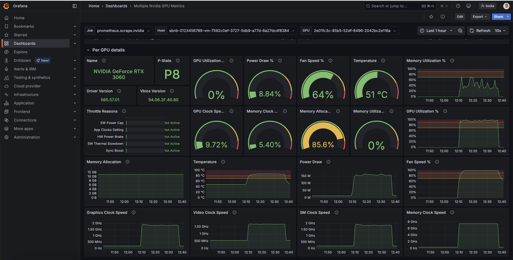
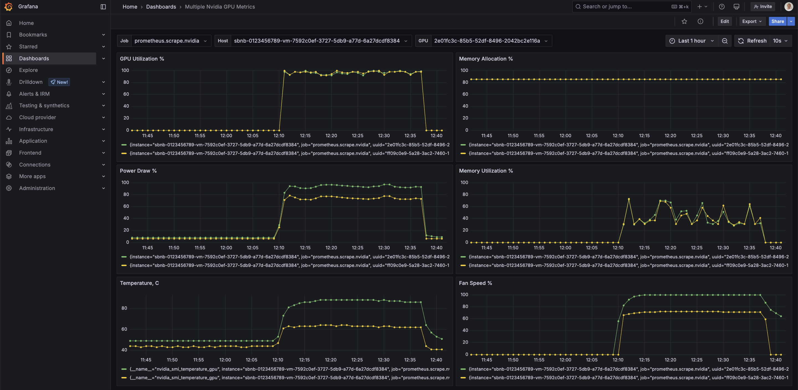

# Run Qwen2.5-VL in vLLM and SGLang in Automated Way

In this tutorial, we will run `"Qwen/Qwen2.5-VL-3B-Instruct"` in an automated way using the **Sbnb Linux** distro and **Ansible**.
We will demonstrate how to use **vLLM** and **SGLang** as inference engines - you can choose either one based on your preference.

---

## Prerequisites

- Boot Bare Metal server into Sbnb Linux. Read more at [README-INSTALL.md](README-INSTALL.md).
- One or more Nvidia GPUs attached to the Bare Metal server
- Laptop with [Tailscale](https://tailscale.com/) configured to access the bare metal server for configuration.

---

## How-To

### 1. Boot Bare Metal Server into Sbnb Linux

Follow [README-INSTALL.md](README-INSTALL.md) to boot your server into Sbnb Linux. After boot, verify it appears in your **Tailscale machine list**:


See [README-SERIAL-NUMBER.md](README-SERIAL-NUMBER.md) for automatic hostname assignment.

---

### 2. Connect Your Laptop to Tailscale

We use a MacBook in this tutorial, but any Linux/Unix laptop should work.

---

### 3. Clone the Sbnb Repository

```sh
git clone https://github.com/sbnb-io/sbnb.git
cd sbnb
```

---

### 4. Start a VM with GPU Passthrough

```sh
ansible-playbook -i sbnb-F6S0R8000719, \
  collections/ansible_collections/sbnb/compute/playbooks/start-vm.yml \
  -e sbnb_vm_tskey="tskey-auth-xxxxx" \
  -e sbnb_vm_attach_gpus=true \
  -e sbnb_vm_vcpu=8 \
  -e sbnb_vm_mem=16G \
  -e sbnb_vm_image_size=100G
```

Replace `sbnb-F6S0R8000719` with your server's Tailscale hostname and `tskey-auth-xxxxx` with your Tailscale auth key.

You should see the VM appear in Tailscale as `sbnb-vm-<VMID>` (e.g., `sbnb-vm-67f97659333f`).

> All Nvidia GPUs will be attached using vfio-pci.


---

### 5. Install Docker and NVIDIA Drivers in the VM

```sh
export VM_HOST=sbnb-vm-67f97659333f

ansible-playbook -i $VM_HOST, \
  collections/ansible_collections/sbnb/compute/playbooks/install-docker.yml

ansible-playbook -i $VM_HOST, \
  collections/ansible_collections/sbnb/compute/playbooks/install-nvidia.yml
```

---

At this point, you have a VM running **Ubuntu 24.04** with **Nvidia GPU** attached.

Below are steps to run either **vLLM** or **SGLang**. Pick the one you prefer:

---

# Run with vLLM

Start vLLM with the Qwen2.5-VL model:

```sh
ansible-playbook -i $VM_HOST, \
  collections/ansible_collections/sbnb/compute/playbooks/run-vllm.yml \
  -e 'sbnb_vllm_args="--model Qwen/Qwen2.5-VL-3B-Instruct --tensor-parallel-size 2 --max-model-len 2048 --dtype bfloat16 --limit-mm-per-prompt image=5,video=5"'
```

> We use `--tensor-parallel-size 2` for 2 GPUs, and choose a small model to fit into 24GB total GPU RAM.

For full options, see [vLLM Engine Args](https://docs.vllm.ai/en/latest/serving/engine_args.html).

vLLM is now up and running!

---

# Run with SGLang

Start SGLang with the Qwen2.5-VL model:

```sh
ansible-playbook -i $VM_HOST, \
  collections/ansible_collections/sbnb/compute/playbooks/run-sglang.yml \
  -e sbnb_sglang_model="Qwen/Qwen2.5-VL-3B-Instruct" \
  -e 'sbnb_sglang_extra_args="--dp 2 --disable-radix-cache --chunked-prefill-size -1 --chat-template qwen2-vl --mem-fraction-static 0.7"'
```

> We use `--dp 2` for 2 GPUs and a small model to fit within available memory.

See [SGLang Server Args](https://github.com/sgl-project/sglang/blob/main/docs/backend/server_arguments.md) for more details.

SGLang is now up and running!

---

# Testing

Let's test by asking the model to recognize text in the Nvidia logo image.

```bash
LLM_URL="http://sbnb-vm-67f97659333f:8000/v1/chat/completions"
IMAGE_URL="https://www.nvidia.com/content/dam/en-zz/Solutions/about-nvidia/logo-and-brand/01-nvidia-logo-horiz-500x200-2c50-d@2x.png"

curl ${LLM_URL}  -H "Content-Type: application/json" -d '{
    "model": "Qwen/Qwen2.5-VL-3B-Instruct",
    "messages": [
      {
        "role": "user",
        "content": [
          {"type": "image_url", "image_url": {"url":"'${IMAGE_URL}'"}},
          {"type": "text", "text": "What is the text in the illustrate?"}
        ]
      }
    ]
}' | jq '.'
```

Replace `LLM_URL` with your VM's Tailscale DNS name. Update `IMAGE_URL` if needed.

We use `jq` to pretty-print the JSON response.

---

## Expected Output

```json
{
  "id": "501a5d9a893241afbab2e4fae5d81916",
  "object": "chat.completion",
  "created": 1743186554,
  "model": "Qwen/Qwen2.5-VL-3B-Instruct",
  "choices": [
    {
      "index": 0,
      "message": {
        "role": "assistant",
        "content": "The text in the illustration is \"nVIDIA.\""
      },
      "finish_reason": "stop"
    }
  ],
  "usage": {
    "prompt_tokens": 1154,
    "completion_tokens": 11,
    "total_tokens": 1165
  }
}
```

Look for `"content": "The text in the illustration is "nVIDIA.""` - that means it's working!

---

## Stopping Services

To stop vLLM:
```sh
ansible-playbook -i $VM_HOST, \
  collections/ansible_collections/sbnb/compute/playbooks/run-vllm.yml \
  -e sbnb_vllm_state=absent
```

To stop SGLang:
```sh
ansible-playbook -i $VM_HOST, \
  collections/ansible_collections/sbnb/compute/playbooks/run-sglang.yml \
  -e sbnb_sglang_state=absent
```

---

## That's it!

You're now running Qwen2.5-VL using either vLLM or SGLang on your own Sbnb Linux VM with full GPU acceleration.

Happy experimenting! Reach out if you have questions or improvements to share!

### Bonus
Want detailed NVIDIA GPU monitoring with Grafana?

Follow this guide:
[NVIDIA GPU Monitoring with Grafana](README-NVIDIA-GPU-FRYER-GRAFANA.md)

You'll get insightful dashboards like these:




