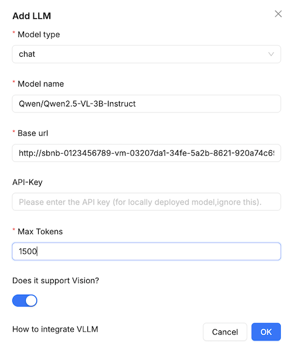
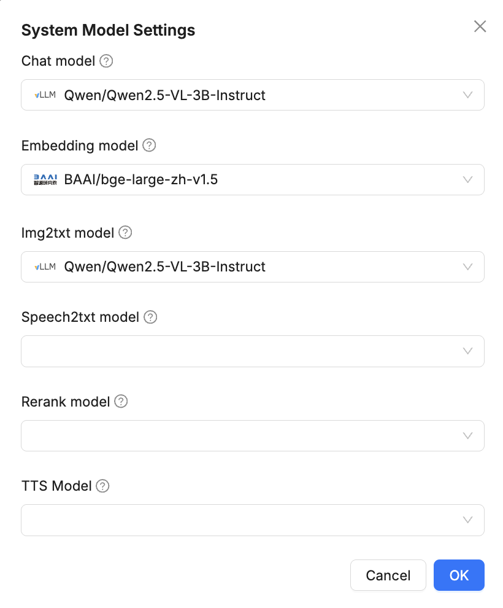
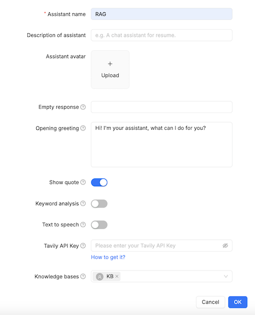
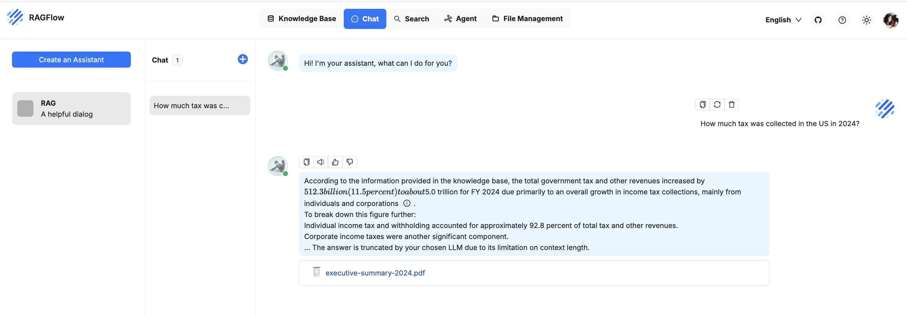

# 🚀 Run RAG on a Bare Metal Server in Minutes (Fully Automated)

This guide walks you through setting up a full RAG pipeline on your own bare metal server in just minutes. You'll launch:

- A bare metal server with Nvidia GPUs running **Sbnb Linux**
- A **VM with Ubuntu 24.04**
- The open-source [**RAGFlow**](https://github.com/infiniflow/ragflow) project
- The [**vLLM inference engine**](https://github.com/vllm-project/vllm) with the `Qwen/Qwen2.5-VL-3B-Instruct` model
- Upload a PDF to RAGFlow and extract knowledge from it

---

## ✅ Why Run RAG on Your Own Bare Metal Server?

### 🔐 Privacy & Security
- Full control over your data - nothing leaves your server  
- Ideal for **sensitive or regulated data** (e.g., healthcare, finance, legal)  
- Compliant with **data sovereignty** requirements (e.g., store and process data within specific countries or jurisdictions)  
- No vendor lock-in - run everything locally or in your own cloud  

### 🔥 Performance
- Faster retrieval and inference

### 💸 Cost Efficiency
- No pay-per-call fees
- Predictable, one-time hardware investment

### 🛠️ Customization
- Your own retrievers, embeddings, chunking strategy
- Fine-tuned or quantized LLMs
- Flexible RAG pipelines (filters, rerankers, etc.)

### 🌐 Offline / Edge Ready
- Fully local operation
- Great for air-gapped or remote deployments

---

## Prerequisites

- Boot Bare Metal server into Sbnb Linux. Read more at [README-INSTALL.md](README-INSTALL.md).
- One or more Nvidia GPUs attached to the Bare Metal server
- Laptop with [Tailscale](https://tailscale.com/) configured to access the bare metal server for configuration.

---

## ⚙️ Step-by-Step Setup

### 1. Boot Bare Metal Server into Sbnb Linux

Follow [README-INSTALL.md](README-INSTALL.md) to boot your server into Sbnb Linux. After boot, verify it appears in your **Tailscale machine list**:


See [README-SERIAL-NUMBER.md](README-SERIAL-NUMBER.md) for automatic hostname assignment.

---

### 2. Connect Your Laptop to Tailscale

We use a MacBook in this tutorial, but any Linux/Unix laptop should work.

---

### 3. Download Tailscale Dynamic Inventory Script

```sh
curl https://raw.githubusercontent.com/m4wh6k/ansible-tailscale-inventory/refs/heads/main/ansible_tailscale_inventory.py -O
chmod +x ansible_tailscale_inventory.py
```

---

### 4. Pull Sbnb Linux Repo

```sh
git clone https://github.com/sbnb-io/sbnb.git
cd sbnb/automation/
```

---

### 5. Configure VM Settings

Edit `sbnb-example-vm.json`:

```json
{
    "vcpu": 16,
    "mem": "64G",
    "tskey": "your-tskey-auth",
    "attach_gpus": true,
    "image_size": "100G"
}
```

Replace `"your-tskey-auth"` with your actual **Tailscale auth key**.

---

### 6. Start VM with Ansible Playbook

```sh
export SBNB_HOSTS=sbnb-F6S0R8000719
ansible-playbook -i ./ansible_tailscale_inventory.py sbnb-start-vm.yaml
```

You should see the VM appear in Tailscale as `sbnb-vm-<VMID>` (e.g., `sbnb-vm-67f97659333f`).

> All Nvidia GPUs will be attached using vfio-pci.


---

### 7. Install Nvidia Drivers and Tools in the VM

```bash
export SBNB_HOSTS=sbnb-vm-67f97659333f

for playbook in install-docker.yaml install-nvidia.yaml install-nvidia-container-toolkit.yaml; do
  ansible-playbook -i ./ansible_tailscale_inventory.py $playbook
done
```

> Note that this time we set `SBNB_HOSTS` to the hostname of the VM we started in the previous step.

These commands will install Docker, Nvidia drivers, Nvidia container toolkit, and SGLang into the VM.

---

At this point, you have a VM running **Ubuntu 24.04** with **Nvidia GPU** attached.

---

## 🤖 Run vLLM

## 1. Configure vLLM

```bash
export LLM_ARGS="--max-model-len 2048
  --gpu-memory-utilization 0.9
  --tensor-parallel-size 2
  --max-num-seqs 32
  --enforce-eager
  --model Qwen/Qwen2.5-VL-3B-Instruct
  --dtype bfloat16
  --limit-mm-per-prompt image=5,video=5"
```

> We use `--tensor-parallel-size 2` for 2 GPUs, and choose a small model to fit into 24GB total GPU RAM.

For full options, see [vLLM Engine Args](https://docs.vllm.ai/en/latest/serving/engine_args.html).

---

## 2. Start vLLM

```bash
ansible-playbook -i ./ansible_tailscale_inventory.py run-vllm.yaml
```

✅ vLLM is now up and running!

---

## 🔁 Run RAGFlow

```bash
ansible-playbook -i ./ansible_tailscale_inventory.py run-ragflow.yaml
```

✅ RAGFlow is up!

---

## 🧠 Configure RAGFlow

### 1. Access the Web UI

Open a browser and navigate to the **VM hostname** from Tailscale. Create an admin account.

---

### 2. Add vLLM as a Model Provider

Go to: `Settings → Model Providers → Add Model`

Fill in:

- **Model type:** `chat`
- **Model name:** `Qwen/Qwen2.5-VL-3B-Instruct`
- **Base URL:** `http://YOUR_VM_HOSTNAME:8000/v1`
- **API Key:** _(leave empty)_
- **Max Tokens:** `1500`
- **Supports Vision:** `Yes`



---

### 3. Set System Models

Go to: `Settings → System Model Settings`  
Select:

- **Chat model:** `Qwen/Qwen2.5-VL-3B-Instruct`
- **Embedding model:** `BAAI/bge-large-zh-v1.5`
- **Img2txt model:** `Qwen/Qwen2.5-VL-3B-Instruct`



---

### 4. Create a Knowledge Base

Navigate to `Knowledge Base → Create`, give it a name.

---

### 5. Upload Documents

For demo purposes, download the latest 2024 US government financial report (latest at the time of writing this tutorial):  
[executive-summary-2024.pdf](https://www.fiscal.treasury.gov/files/reports-statements/financial-report/2024/executive-summary-2024.pdf)

Then:

- Click `Add File → Local files`
- Enable `Parse on creation`
- Upload the PDF

Wait for **Parsing Status** to turn **SUCCESS**.


---

### 6. Create an Assistant

- Go to `Chat → Create an Assistant`
- Set an **Assistant name**
- Choose your **Knowledge Base**



---

### 7. Start Chatting

Select your assistant and click `+` to start a chat.

Try this question (answer is only in the PDF):

> "How much tax was collected in the US in 2024?"

✅ RAGFlow responds with the answer **"... 5.0 trillion for FY 2024"** and cites the PDF source.



---

🎉 That’s it! You've successfully combined a stock LLM with your own custom knowledge base.

Happy experimenting - and solving real-world problems!

