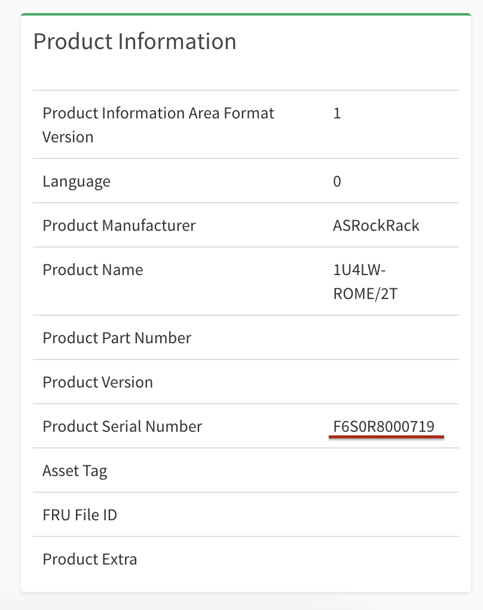

# Assigning Hostnames Automatically in Sbnb Linux

During the boot process, Sbnb Linux reads the machine's serial number and assigns the hostname as:

```
sbnb-${SERIAL}
```

If no serial number can be read, then a randomly generated string is used instead.

Once the machine boots and connects to [Tailscale](https://tailscale.com/) (tailnet), it will be identified using the assigned hostname.

## Example
Below are pictures from a test 1U rack-mount machine based on an ASRock motherboard:

### Serial number on the top of the chassis case


### Serial number in the ASRock BMC Web User Interface (WebUI)



### Serial number retrieved using `dmidecode` on the Linux command line


### Machine registered in Tailscale (tailnet)


