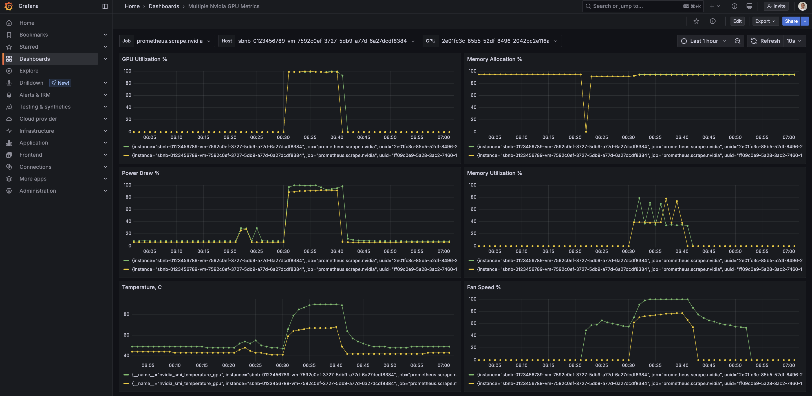

# Run SGLang with Nvidia GPU under Sbnb Linux in Automated Way

This tutorial will show how to get SGLang on a Bare Metal server up & running with Nvidia GPU in minutes.

We also start monitoring using Grafana and run a benchmark from [vLLM](https://github.com/vllm-project/vllm) project. At the end, you will be able to see the following benchmark results and monitoring graphs from your Bare Metal server.

The graph below shows GPU load during a benchmark test for a few minutes, leading to a GPU load spike to 100%.




## Prerequisites

- Boot Bare Metal server into Sbnb Linux. Read more at [README-INSTALL.md](README-INSTALL.md).
- One or more Nvidia GPUs attached to the Bare Metal server
- Laptop with [Tailscale](https://tailscale.com/) configured to access the bare metal server for configuration.


## Howto

### 1. Boot Bare Metal Server into Sbnb Linux
Boot the Bare Metal server into Sbnb Linux using the instructions in [README-INSTALL.md](README-INSTALL.md). After booting, verify that the server appears in your **Tailscale machine list**.


For more details on automatic hostname assignments, refer to [README-SERIAL-NUMBER.md](README-SERIAL-NUMBER.md).

### 2. Connect Your Laptop to Tailscale
We will use a MacBook in this tutorial, but any machine, such as a Linux instance, should work the same.

### 3. Download Tailscale Dynamic Inventory Script
```sh
curl https://raw.githubusercontent.com/m4wh6k/ansible-tailscale-inventory/refs/heads/main/ansible_tailscale_inventory.py -O
chmod +x ansible_tailscale_inventory.py
```

### 4. Pull Sbnb Linux Repo with All Required Grafana Configs and Ansible Playbooks
```sh
git clone https://github.com/sbnb-io/sbnb.git
cd sbnb/automation/
```

### 5. Configure VM Settings
Open `sbnb-example-vm.json` file with an editor of your choice and configure the following parameters:
```json
{
    "vcpu": 2,
    "mem": "4G",
    "tskey": "your-tskey-auth",
    "attach_gpus": true,
    "image_size": "10G"
}
```
Replace `"your-tskey-auth"` with your actual Tailscale key.

### 6. Start VM with Ansible Playbook
```sh
export SBNB_HOSTS=sbnb-F6S0R8000719

ansible-playbook -i ./ansible_tailscale_inventory.py sbnb-start-vm.yaml
```

Once the VM starts, you should see it appear in the Tailscale network as `sbnb-vm-VMID`. For example, `sbnb-vm-67f97659333f`.

All Nvidia GPUs present in the system will be attached to this VM using a low-overhead vfio-pci mechanism:


### 7. Configure SGLang

By default, `run-sglang.yaml` has the following settings:

```text
  -m sglang.launch_server
  --host 0.0.0.0
  --port 30000
  --model-path TinyLlama/TinyLlama-1.1B-Chat-v1.0
  --dp 2
```

We’re setting data parallelization `--dp 2` because we have 2 Nvidia GPU cards in the system. We also choose a small model `"TinyLlama/TinyLlama-1.1B-Chat-v1.0"` to fit our limited GPU memory (12GB * 2 = 24GB) in this setup.

Please refer to the SGLang engine arguments for more details:  
https://github.com/sgl-project/sglang/blob/main/docs/backend/server_arguments.md

### 8. Start SGLang in the VM

Run on the laptop:

```bash
export SBNB_HOSTS=sbnb-vm-67f97659333f

for playbook in install-docker.yaml install-nvidia.yaml install-nvidia-container-toolkit.yaml run-sglang.yaml; do
  ansible-playbook -i ./ansible_tailscale_inventory.py $playbook
done
```

> Note that this time we set `SBNB_HOSTS` to the hostname of the VM we started in the previous step.

These commands will install Docker, Nvidia drivers, Nvidia container toolkit, and SGLang into the VM.

**Congratulations!** Now you have SGLang up and running.

## Run Benchmark

Run on the laptop:

```bash
ansible-playbook -i ./ansible_tailscale_inventory.py run-sglang-benchmark.yaml
```

### Example Output of the Benchmark

```text
    Starting initial single prompt test run...                                                                                                 
    Initial test run completed. Starting main benchmark run...                                                                                 
    Traffic request rate: inf                                          
    Burstiness factor: 1.0 (Poisson process)                                                                                                   
    Maximum request concurrency: None                                                                                                          
    ============ Serving Benchmark Result ============                                                                                         
    Successful requests:                     10000                                                                                             
    Benchmark duration (s):                  640.00                                                                                            
    Total input tokens:                      10240000                                                                                          
    Total generated tokens:                  1255483                                                                                           
    Request throughput (req/s):              15.63                                                                                             
    Output token throughput (tok/s):         1961.70                                                                                           
    Total Token throughput (tok/s):          17961.80                                                                                          
    ---------------Time to First Token----------------                                                                                         
    Mean TTFT (ms):                          305092.39                                                                                         
    Median TTFT (ms):                        302889.37                                                                                         
    P99 TTFT (ms):                           610125.77                 
    -----Time per Output Token (excl. 1st token)------                                                                                         
    Mean TPOT (ms):                          283.72                                                                                            
    Median TPOT (ms):                        199.65                                                                                            
    P99 TPOT (ms):                           3285.50                                                                                           
    ---------------Inter-token Latency----------------                                                                                         
    Mean ITL (ms):                           231.37
    Median ITL (ms):                         60.73
    P99 ITL (ms):                            1533.73
    ==================================================  
```

## Display GPU Utilization in Grafana

Follow this guide:  
[README-NVIDIA-GPU-FRYER-GRAFANA.md](README-NVIDIA-GPU-FRYER-GRAFANA.md)


## ✅ Summary

You now have:

- A GPU-enabled VM on Bare Metal running Sbnb Linux
- SGLang deployed automatically via Ansible
- Full monitoring via Grafana
- Benchmark results confirming throughput and performance

**Happy experimenting with SGLang!**
