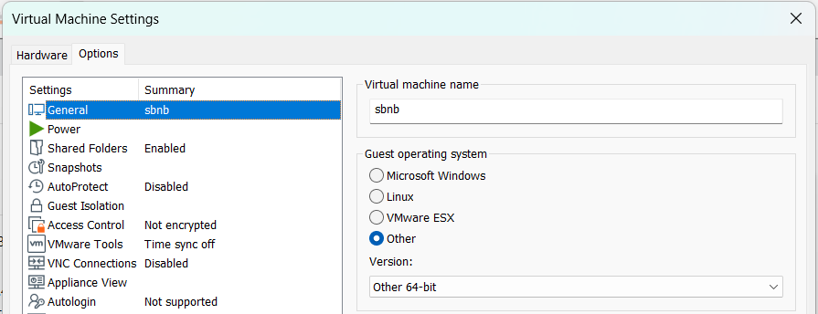
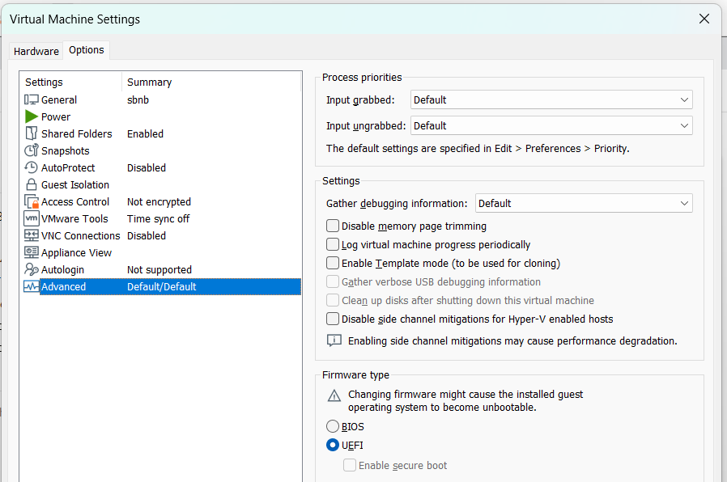
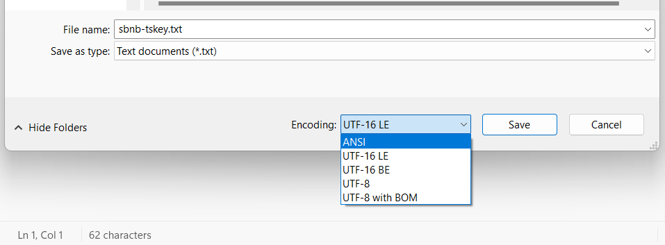
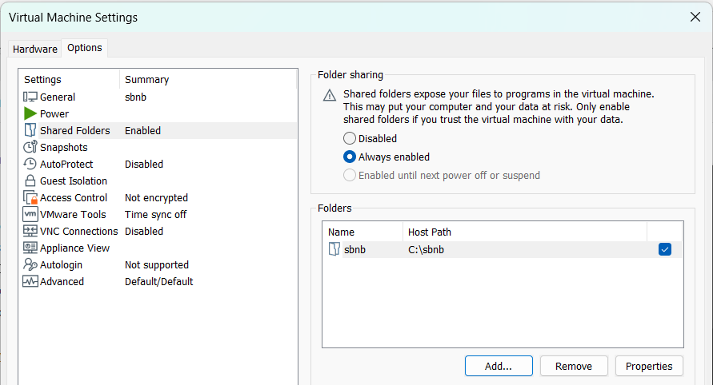
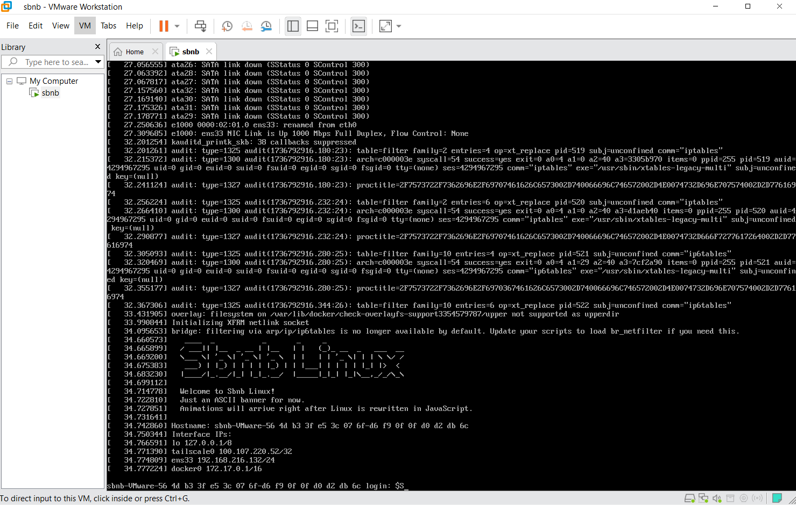

# Running Sbnb Linux as a VMware Guest

## Prerequisites
- VMware Workstation installed on your system.
- A valid [Tailscale.com](https://tailscale.com) key.

## Steps to Set Up

1. **Download the Disk Image**
   - Navigate to the [Releases](https://github.com/sbnb-io/sbnb/releases) section of this repository.
   - Download the `sbnb.vhd` disk image.

2. **Create a VMware Virtual Machine**
   - Open VMware and create a new virtual machine with the following settings:
     1. **Guest Operating System**: Select `Other 64-bit`

     3. **Firmware Type**: Choose `UEFI`.

3. **Prepare the Tailscale Key**
   - Create a folder named `sbnb` on your host system.
   - Inside the `sbnb` folder, create a text file named `sbnb-tskey.txt`.
   - Paste your Tailscale key into the file.
   - Save the file in **ANSI** format (not UTF).

4. **Attach the Folder to the VMware VM**
   - Attach the `sbnb` folder as a shared folder in the VMware VM settings.

5. **Start the Virtual Machine**
   - Power on the VMware VM.

   - Once booted, the VM should automatically appear in your Tailscale device list.
   - You can SSH into the VM using OAuth, such as Google Auth.

## What Can I Do with Sbnb Linux?
For more details on usage, refer to the following sections in the main [Sbnb Linux README](https://github.com/sbnb-io/sbnb):

- **Running the "Hello World" Example on Sbnb Linux**
- **How to Start Customer Workloads on Sbnb Linux**
