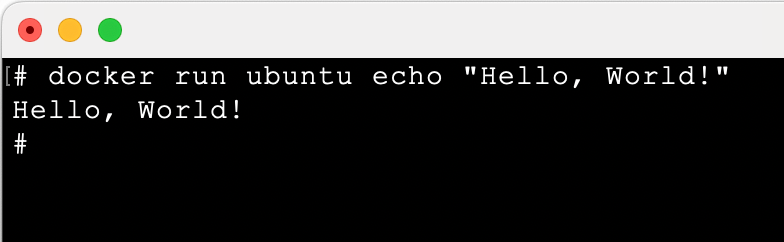
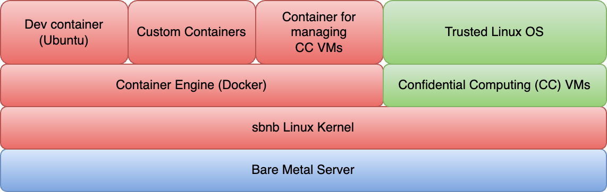
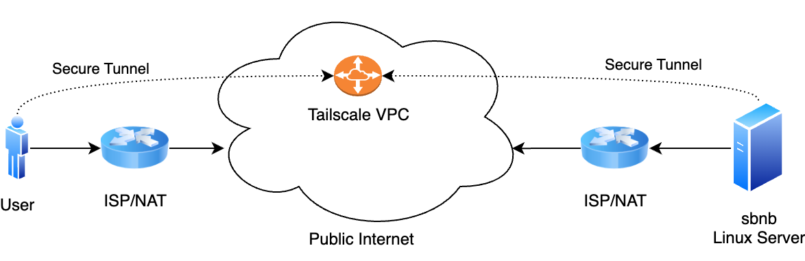
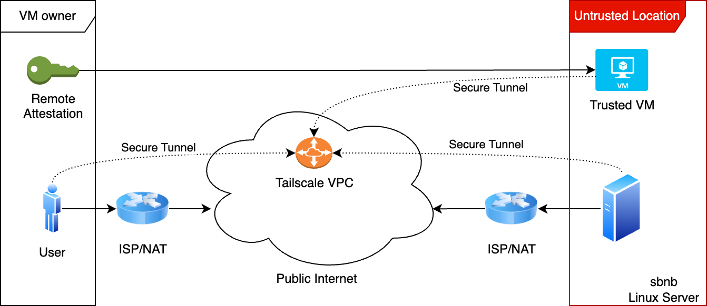

## Sbnb Linux

Sbnb Linux is a revolutionary minimalist Linux distribution designed to boot bare-metal servers and enable remote connections through fast tunnels. It is ideal for environments ranging from home labs to distributed data centers. Sbnb Linux is simplified, automated, and resilient to power outages, supporting confidential computing to ensure secure operations in untrusted locations.

### Prerequisites

- **Bare Metal Server:** Any x86 machine should suffice.
    - For example, take a look at this [Reddit post](https://www.reddit.com/r/homelab/comments/1hmnnwg/built_a_powerful_and_silent_amd_epyc_home_server/) where we built a powerful and quiet AMD EPYC 3rd Gen home server together with my kids.
- **USB Flash Drive** for booting.
    - Any standard USB flash drive with at least 512MB capacity will work. Please note that all existing data on the drive will be overwritten.
Thank you for the feedback, and I apologize for the unclear wording.
- **[Optional]** If you plan to launch Confidential Computing (CC) Virtual Machines (VMs) on Sbnb Linux, ensure that your CPU supports AMD SEV-SNP technology (available from AMD EPYC Gen 3 CPUs onward). Additionally, enable this feature in the BIOS. For more details, refer to [README-CC.md](https://github.com/sbnb-io/sbnb/blob/main/README-CC.md).

### Typical Use Case for Sbnb Linux
- **Run Sbnb Linux on Bare Metal Server** - In summary, the bare metal server boots into a minimal Linux environment consisting of a Linux kernel with Tailscale and the Docker container engine.
From this environment, you can execute any Linux distribution that has a corresponding Docker container (which covers nearly all distributions) using the following command:
```
docker run --privileged -it -v /root:/root -v /dev:/dev --net=host ubuntu:24.04 bash
```

Simply replace `ubuntu:24.04` with the desired distribution, such as `centos`, `alpine`, or any other Docker-supported distribution.

- **Run Sbnb Linux as a VM Guest** - Please refer to the separate document on how to run Sbnb Linux as a VMware Guest: [README-VMWARE.md](https://github.com/sbnb-io/sbnb/blob/main/README-VMWARE.md).
However, VMware is not a hard requirement. Any VM hypervisor, such as QEMU, can also be used.

### Key Features of Sbnb Linux:

- **Minimalist OS** – Bare metal servers boot into sbnb Linux, a lightweight OS combining a Linux kernel with Docker. The package list is minimal to reduce image size and limit attack vectors from vulnerabilities.
- **Runs in Memory** – sbnb Linux doesn’t install on system disks but runs in memory, similar to liveCDs. A simple power cycle restores the server to its original state, enhancing resilience.
- **Configuration on Boot** – sbnb Linux reads config file from a USB dongle during boot to customize the environment.
- **Immutable Design** – Sbnb Linux is an immutable, read-only Unified Kernel Image (UKI), enabling straightforward image signing and attestation. This design makes the system resistant to corruption or tampering ("unbreakable").
- **Remote Access** – A Tailscale tunnel is established during boot, allowing remote access. The Tailscale key is specified in a config file.
- **Confidential Computing** – The sbnb Linux kernel supports Confidential Computing (CC) with the latest CPU and Secure Processor microcode updates applied at boot. Currently, only AMD SEV-SNP is supported.
- **Flexible Environment** – sbnb Linux includes scripts to start Docker containers, allowing users to switch from the minimal environment to distributions like Debian, Ubuntu, CentOS, Alpine, and more.
- **Developer Mode** – Activate developer mode by running the `sbnb-dev-env.sh` script, which launches anDebian/Ubuntu container with various developer tools pre-installed.
- **Reliable A/B Updates** – If a new version fails, a hardware watchdog automatically reboots the server into the previous working version. This is crucial for remote locations with limited or no physical access.
- **Regular Update Cadence** – Sbnb Linux follows a predictable update schedule. Updates are treated as routine operations rather than disruptive events, ensuring the system stays protected against newly discovered vulnerabilities.
- **Firmware Updates** – Sbnb Linux applies the latest CPU and Security Processor microcode updates at every boot. BIOS updates can also be applied during the update process, keeping the entire system up to date.
- **Built with Buildroot** – sbnb Linux is created using Buildroot with the br2-external mechanism, keeping sbnb customizations separate for easier maintenance and rolling updates.


## How to Boot Your Server into Sbnb Linux

1. **Download the `sbnb.raw` image**
    - Head to the [Releases](https://github.com/sbnb-io/sbnb/releases) section of this repository and download the `sbnb.raw` image (~200 MB).
2. **Write the Image to a USB Flash Drive**
    - The following steps are for macOS, but they can be adapted for Linux or Windows.
    - **Identify the USB flash drive:**
        
        Run the command:
        
        ```bash
        diskutil list
        ```
        
        Look for an entry like `/dev/disk4 (external, physical)`.
        
        ⚠️ **Warning:** This process will erase all data on the USB drive. Verify the disk size carefully to avoid overwriting the wrong device.
        
    - **Write the `sbnb.raw` image to the USB drive:**
        
        ```bash
        sudo diskutil unmountDisk /dev/disk4
        sudo dd if=sbnb.raw of=/dev/disk4 status=progress
        ```
        
        Replace `/dev/disk4` with the correct disk number from the previous step.
        
3. **Add Your Tailscale Key to the USB Drive**
    - Create a mount point and mount the USB drive:
        
        ```bash
        mkdir sbnb
        sudo mount -t msdos /dev/disk4s1 sbnb
        ```
        
    - Add your Tailscale key to the drive:Replace **`tskey-auth-KEY`** with your actual Tailscale key. For instructions on generating a key, visit [tailscale.com](https://tailscale.com/).
        
        ```bash
        echo "tskey-auth-KEY" > sbnb/sbnb-tskey.txt
        ```
        
    - Unmount the USB drive:
        
        ```bash
        sudo diskutil unmountDisk /dev/disk4
        ```
        
4. **Boot the Server**
    - Insert the USB drive into your server and power it on.
    - You may need to select the USB flash drive as the first boot device in your BIOS/UEFI settings if another operating system is installed or if network boot is enabled.
    - Booting may take **5 to 10 minutes**, depending on your server’s BIOS configuration.
5. **Verify the Server on Tailscale**
    - After booting, check your server in the **Tailscale machine list**.
6. **Done!**
    - You can now SSH into the server using Tailscale SSO methods, such as Google Auth.
7. **Next Steps**
    - For development and testing, we recommend running the following command after SSH-ing into the server
    ```bash
    sbnb-dev-env.sh
    ```
    This will transition your environment from the minimalist setup to a full Docker container running Debian/Ubuntu, preloaded with useful development tools.

## Running the "Hello World" Example on Sbnb Linux

After connecting to Sbnb Linux via SSH, you can easily run an Ubuntu container that prints "Hello, World!" by executing the following command:

```
docker run ubuntu echo "Hello, World!"
```
You can replace `ubuntu` with `centos`, `alpine`, or any other distribution of your choice.

If successful, you should see output similar to the image below:

 



Congratulations! Your Sbnb Linux environment is now up and running. We're excited to see what you'll create next!

## How to Start Customer Workloads on Sbnb Linux  

Sbnb Linux provides several options for starting customer jobs, depending on the environment and security requirements.  

| Option | Description | Recommended Use | Example Link |  
|--------|-------------|-----------------|--------------|  
| **Run Directly on Minimalist Environment** | Execute jobs directly on the lightweight Sbnb Linux environment. Suitable for system services like observability or monitoring. | Not recommended for regular jobs. Use for system services. | [Example: Tailscale Tunnel Startup](/board/sbnb/sbnb/rootfs-overlay/usr/lib/systemd/system/tailscaled.service) |
| **Docker Container** | Launch Docker containers (Ubuntu, Fedora, Alpine, etc.) on top of the minimalist environment. This approach powers the `sbnb-dev-env.sh` script to create a full development environment. | Recommended for trusted environments (e.g., home labs). | [Example: Development Environment](/board/sbnb/sbnb/rootfs-overlay/usr/sbin/sbnb-dev-env.sh) |
| **Run Regular Virtual Machine (VM)** | Start a standard VM to run full-featured OS like Windows or other Linux distributions. | Recommended for trusted environments (e.g., home labs). | [Detailed Documentation](/README-VM.md) |
| **Confidential Computing Virtual Machine (CC VM)** | Start a CC VM to run production workloads securely. Encrypts memory and CPU states, enabling remote attestation to ensure code integrity. | Recommended for production environments. | [Detailed Documentation](/README-CC.md) |

## Build sbnb Image Yourself

- Clone this repository.
```
git clone https://github.com/sbnb-io/sbnb.git
cd sbnb
git submodule init
git submodule update
```
- Start the build process.
```
cd buildroot
make BR2_EXTERNAL=.. sbnb_defconfig
make -j $(nproc)
```
- After a successful build, the following files will be generated:
    - **`output/images/sbnb.efi`** – A UEFI bootable Sbnb image in Unified Kernel Image (UKI) format. This file integrates the Linux kernel, kernel arguments (cmdline), and initramfs into a single image.
    - **`output/images/sbnb.raw`** – A disk image ready to be written directly to a USB flash drive for server booting. It features a GPT partition table and a bootable VFAT partition containing the UEFI bootable image (`sbnb.efi`).

Happy developing! Contributions are encouraged and appreciated!

## Architecture and Technical Details

Sbnb Linux is built from source using the Buildroot project. It leverages the [Buildroot br2-external mechanism](https://buildroot.org/downloads/manual/manual.html#outside-br-custom) to keep Sbnb-specific customizations separate, simplifying maintenance and enabling smooth rolling updates.

### Boot Image
The Linux kernel is compiled and packaged with the command line and initramfs into a single binary called the Unified Kernel Image (UKI). The UKI is a PE/COFF binary, allowing it to be booted by any UEFI BIOS. This makes Sbnb Linux compatible with any modern machine. The total size of the image is approximately 200MB.

### Initramfs Components:
- BusyBox: Provides a shell and other essential tools.
- Systemd: Serves as the init system.
- Tailscale: Pre-installed to establish secure tunnels.
- Docker Engine: Installed to enable running any container.

This minimal setup is sufficient to boot the system and make the bare metal accessible remotely. From there, users can deploy more advanced software stacks using Docker containers or Virtual Machines, including Confidential Computing VMs.

See the diagram below for the internal structure of sbnb Linux.



### Use Cases

The diagram below illustrates the concept of Sbnb Linux, where servers connect to the public Internet through ISP links and NAT. These servers create an overlay network across the public Internet using secure tunnels, powered by Tailscale, resulting in a flat, addressable space.


 

The next diagram illustrates how a Virtual Machine (VM) owner can verify and establish trust in a VM running on an Sbnb server located in an untrusted physical environment. This is achieved by leveraging AMD SEV-SNP’s remote attestation mechanism. This approach enables the creation of distributed data centers with servers deployed in diverse, untrusted locations such as residences, warehouses, mining farms, shipping containers, colocation facilities, or remote sites near renewable energy sources.



## Alternative Linux Distributions with Similar Concepts to Sbnb Linux

If you're interested in exploring the fascinating world of immutable, container-optimized Linux distributions, here are some notable projects worth checking out:

- [Fedora CoreOS](https://fedoraproject.org/coreos/)
- [Bottlerocket OS](https://github.com/bottlerocket-os/bottlerocket)
- [Flatcar Container Linux](https://www.flatcar.org/) (acquired by Microsoft)
- [RancherOS](https://rancher.com/docs/os/v1.x/en/)
- [Talos Linux](https://www.talos.dev/)


## Frequently Asked Questions
### What benefits does it offer compared to using Cloud-init on any distro?
While it's true that almost any distribution can be minimized, configured to run in-memory, and integrated with Cloud-init or Kickstart, this approach focuses on building a system from the ground up. This avoids the need to strip down a larger, more complex system, eliminating compromises and workarounds typically required in such cases.

### Will power cycling wipe out the Docker containers you've installed?
Yes, power cycling will restore the system to a known good baseline state. Sbnb Linux is designed this way to ensure reliability and stability. After a power cycle, automation tools can be used to pull and run the containers again on the node. This design makes Sbnb Linux highly resilient and virtually unbreakable.
