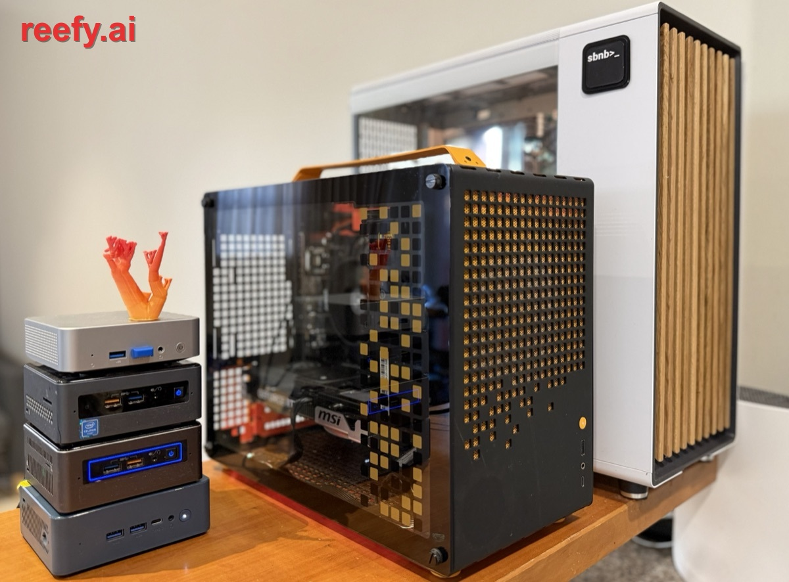
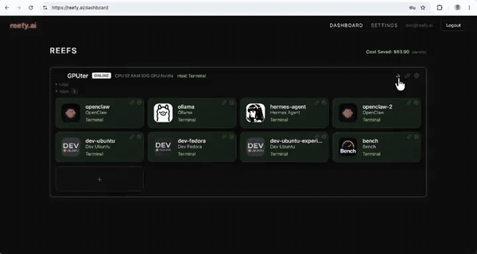
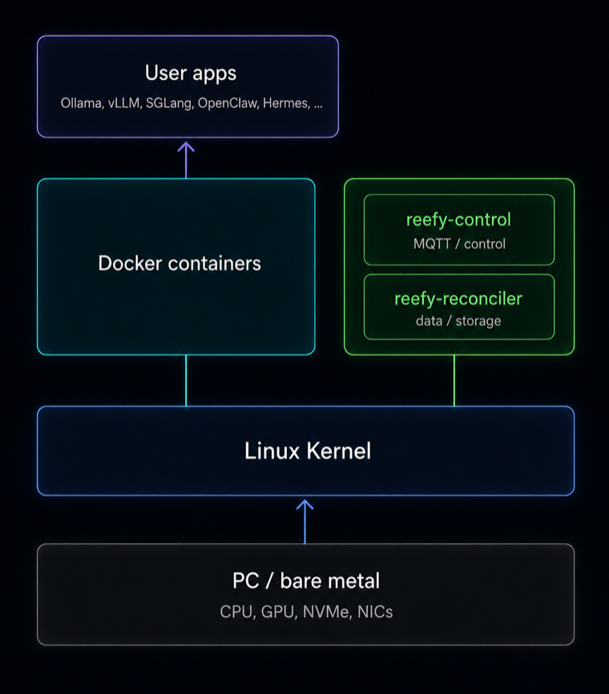
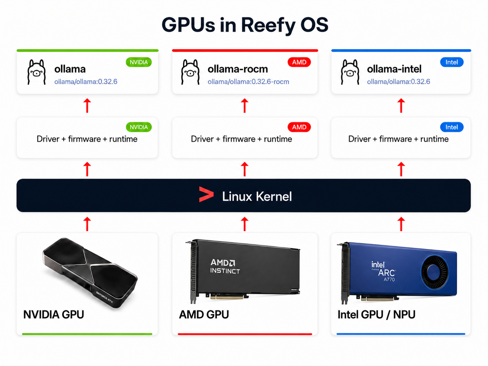
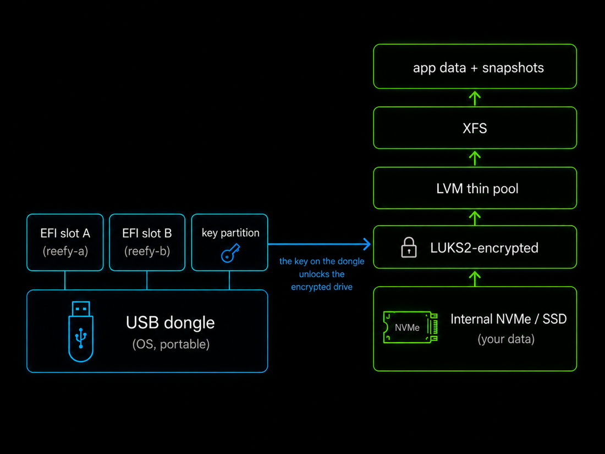
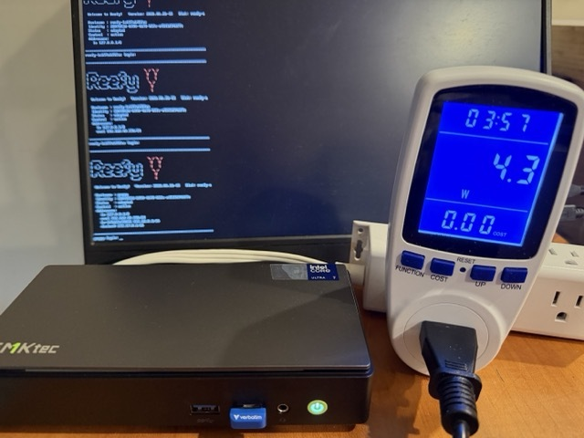

<p align="center">
  
</p>

<h1 align="center">Reefy OS</h1>

<p align="center">
  <strong>An operating system for the new generation of AI computers.</strong><br>
  Turn hardware you own into AI infrastructure that is easy to deploy, manage, and recover.
</p>

<p align="center">
  
</p>

## One OS for AI computers

Reefy turns PCs, workstations, edge systems, and datacenter servers into AI
computers that are easy to operate. AI workloads run directly on hardware you
own or control, with GPU and NPU acceleration where supported.

### One platform across diverse hardware

Like Android did for phones, Reefy provides a common platform across different
hardware. Run the same system on an Intel mini-PC, an AMD workstation, or an
NVIDIA GPU server.

### Accelerator support without driver wrangling

Reefy delivers build-matched accelerator support bundles for NVIDIA, AMD, and
Intel hardware, including Intel GPUs and NPUs. Drivers and firmware integrate
with the OS while AI runtimes stay with the applications that use them.

### An app platform for AI-assisted development

Apps declare their services, storage, networking, and accelerator needs. Reefy
handles the machine-level integration, making apps easier to build, inspect,
and modify with traditional development tools or AI coding tools.

## What Reefy provides

| Benefit | How Reefy delivers it |
|---|---|
| Run AI on hardware you own | Bare-metal containers with build-matched GPU and NPU support for NVIDIA, AMD, and Intel |
| Deploy applications consistently | Versioned container packages become declarative device state |
| Manage every machine in one place | Real-time fleet status, metrics, application control, and remote access |
| Recover from failed OS updates | Health-gated A/B firmware with automatic rollback and hardware-watchdog recovery |
| Keep running without the cloud | Persisted desired state, cached applications, and local network access |
| Protect and move application data | LUKS2 encryption, LVM thin snapshots, XFS, and encrypted deduplicated backups |

### Every machine in one dashboard

Every Reefy machine and application is managed from one responsive dashboard.
Device status, system metrics, applications, and remote access remain available
without managing each box individually.

<p align="center">
  
</p>

### Built-in monitoring from first boot

After adoption, Reefy publishes CPU, memory, storage, network, and GPU metrics
automatically. Power, temperatures, fan speeds, and vendor-specific readings
appear when exposed by supported hardware. Reefy stores the time series for
live and historical fleet views, with nothing extra to install or wire up.

<p align="center">
  
</p>

## Architecture

A Reefy device has a deliberately small host. Reefy brings up the hardware,
storage, networking, accelerator support bundles, and Docker. Application
runtimes, frameworks, models, and application code remain in versioned
container images.

### Architecture at a glance

<p align="center">
  
</p>

### Clear layer boundaries

| Layer | Responsibility |
|---|---|
| Firmware and boot | Unified Kernel Image, A/B slots, health-gated updates, and watchdog recovery |
| Control plane | Authenticated MQTT connection, desired-state delivery, commands, and device status |
| Reconciler | Storage, networking, accelerator preparation, and Compose application lifecycle |
| Accelerator support bundles | OS-matched drivers, firmware, activation, diagnostics, and CDI publication |
| Application images | AI runtimes, frameworks, models, and application code |

### Applications start without the cloud

The control plane comes up early so a machine remains visible even when an
application or storage operation fails. The reconciler persists the last
applied state and re-applies it on every boot. Applications therefore do not
wait for a cloud connection before starting.

Read the full [operating system overview](https://reefy.ai/docs) and
[desired-state architecture](docs/desired-state.md).

## GPU and NPU hardware support

Reefy supports the three major accelerator ecosystems through separately
delivered, build-matched driver and firmware bundles. Internally, Reefy calls
these artifacts host providers.

<p align="center">
  
</p>

### Host support stays separate from AI runtimes

A support bundle contains only the host components needed to make an
accelerator usable. Frameworks and development libraries stay with the
application that uses them.

| Hardware | Support bundle supplies | Application image supplies |
|---|---|---|
| NVIDIA GPU | Kernel modules, matching firmware, host integration, diagnostics, and CDI devices | CUDA, TensorRT, PyTorch, inference servers, and application code |
| AMD GPU | Kernel modules, matching firmware, host integration, diagnostics, and CDI devices | ROCm, HIP, PyTorch, inference frameworks, and application code |
| Intel GPU and NPU | GPU and NPU activation, matching firmware, host integration, and CDI devices | OpenVINO, oneAPI libraries, models, and application code |

### Driver support stays in sync with the OS

Each support bundle is built for an exact Reefy OS and kernel version. Reefy
rejects incompatible bundles, preventing driver mismatches during updates and
rollbacks.

### Common delivery, vendor-specific runtimes

This common architecture does not pretend that vendor software is
interchangeable. CUDA, ROCm, and OpenVINO applications retain their own runtime
requirements. Reefy standardizes how the matching host support is delivered,
verified, activated, and exposed to containers.

See the
[detailed accelerator architecture](https://reefy.ai/docs/internals/accelerator-providers).

## An application layer for AI software

### Describe the application, not the machine

A Reefy app is a versioned container package rather than a machine-specific
installation procedure. Its manifest can describe:

- the container image, version, launch command, and container listener port;
- persistent volumes, ownership, capacity, backup, and restore behavior;
- environment defaults and generated configuration files;
- accelerator, device, memory, process, and networking requirements; and
- Reefy platform capabilities used by the application.

### Reefy turns the manifest into running infrastructure

Reefy combines that package with the user's instance settings and turns it
into desired state. The device prepares storage, configures the requested
hardware, renders a Compose project, starts the application, and reports its
lifecycle events.

### Built for humans and AI coding tools

The app definition is compact, declarative, and reviewable. Specialized code
stays in a conventional container image, while Reefy supplies the repeatable
host integration beneath it.

Read [How Reefy apps work](docs/reefy-apps.md).

## Designed for unattended machines

### Boot and storage layout

A common Reefy layout separates the portable OS and encryption key from
internal application data. Two EFI slots provide A/B firmware, while the key
partition unlocks the LUKS2-encrypted LVM and XFS storage stack.

<p align="center">
  
</p>

### Recoverable firmware updates

Reefy boots from a Unified Kernel Image and maintains two firmware slots. An
update fully recreates the inactive slot, writes the new image there, and asks
UEFI to try it once. Reefy commits the slot only after storage and the control
plane become healthy.

If the new system cannot reach that health check, UEFI returns to the previous
slot. On systems with a supported hardware watchdog, Reefy has a second
recovery path if the kernel hangs before userspace can report failure.

Read [A/B firmware updates](docs/a-b-firmware-updates.md) and the
[watchdog architecture](docs/watchdog-architecture.md).

### Offline by default after configuration

The reconciler saves desired state and application images locally. On boot it
restores storage, networking, cached accelerator support bundles, and
applications without waiting for MQTT or internet access. The control plane
reconnects asynchronously when a network becomes available.

Applications are also reachable on the local network. Remote management and
authenticated tunnels add convenience, but they are not part of the
application boot dependency chain.

### Encrypted, snapshot-ready storage

Internal application storage uses the following data path:

```text
LUKS2 encryption -> LVM thin pool -> per-application thin volumes -> XFS
```

Thin volumes provide fast, space-efficient, crash-consistent snapshot backups.
Selected application data is deduplicated and encrypted before it leaves the
device. A restored application can be brought up on another Reefy machine from
the same desired state and backup archive.

Read the [storage architecture](docs/storage-architecture.md) and
[security model](docs/security-model.md).

## Security model

Reefy reduces the trusted computing base instead of relying on any single
security feature.

- **Traceable firmware:** Public source, automated builds, artifact digests,
  and signed provenance connect firmware to its source revision.
- **Minimal immutable host:** Buildroot includes an explicit package set, with
  no general-purpose system package manager such as apt or dnf and a read-only
  SquashFS base.
- **Recoverable updates:** Health-gated A/B firmware and watchdog rollback
  reduce the risk of failed remote updates.
- **Separated workloads and data:** Applications run in containers, while
  persistent storage is encrypted with LUKS2.

These controls reduce attack surface, configuration drift, and recovery risk.
They do not make containers perfect isolation or protect mounted data after a
privileged host compromise.

Read the full [Reefy OS security model](docs/security-model.md).

## Release validation

An official Reefy release is promoted only after automated unit and
integration tests, the complete end-to-end promotion suite, and real-hardware
validation pass.

The end-to-end suite exercises firmware builds, boot and adoption, the
dashboard, API, MQTT, application lifecycle, storage, backup and restore,
offline operation, A/B updates, rollback, and failure recovery. Protected lab
systems validate real NVIDIA, AMD, Intel GPU, and Intel NPU execution using
functional CUDA, HIP, and OpenVINO probes.

QEMU provides repeatable failure and migration testing. The hardware fleet
confirms that drivers, firmware, accelerators, and applications work together
on physical machines before release.

## Benchmarking AI hardware in the real world

Reefy is developed through hands-on research and benchmarking on real
hardware. We publish the workload, system configuration, measurement method,
telemetry, results, and known gaps so each study can be inspected and
reproduced.

<p align="center">
  <br>
  <em>Intel Core Ultra test system at idle: 4.3 W measured at the wall.</em>
</p>

### One example: video AI inference

We compared Intel integrated GPU and NPU inference with an NVIDIA GPU using a
complete YOLO-NAS video pipeline. The study measured H.264 decode,
preprocessing, object detection, and total wall power across three accelerator
paths:

| Device path | Maximum FPS | System FPS/W |
|---|---:|---:|
| NVIDIA GeForce RTX 5060 Ti system | 143.8 | 0.81 |
| Intel Core Ultra integrated GPU | 96.6 | 3.85 |
| Intel Core Ultra NPU | 133.2 | 9.00 |

These results are specific to the tested workload and complete system
configurations. See the
[complete AI video inference benchmark](https://reefy.ai/benchmarks/ai-video-inference)
for methodology, hardware details, telemetry, reproduction steps, and known
gaps.

## Get started

1. Bring an x86-64 PC, mini-PC, workstation, or GPU server.
2. Sign in at [reefy.ai](https://reefy.ai) and download your personalized image.
3. Flash the downloaded `.raw` image to a USB drive and boot the machine.
4. Adopt the device from the Reefy dashboard and start an application.

The USB drive contains the operating system and can also hold the encryption
key, leaving internal NVMe or SSD capacity available for encrypted application
data. Reefy can also be flashed to an internal drive.

## Build from source

Official Reefy firmware builds are automated with GitHub Actions. The workflow
builds production and development firmware images and publishes them as CI
artifacts.

To reproduce or modify the firmware locally, use Ubuntu 24.04, install the
[same build prerequisites as CI](.github/workflows/firmware-build.yml), and run:

```bash
git clone --recurse-submodules https://github.com/reefyai/reefy.git
cd reefy/buildroot
make BR2_EXTERNAL=.. reefy_defconfig
make -j"$(nproc)"
```

The resulting artifacts are written to `buildroot/output/images/`:

| Artifact | Description |
|---|---|
| `reefy-prod.{efi,raw}` | Production Unified Kernel Image and flashable disk image |
| `reefy-dev.{efi,raw}` | Development images with the diagnostic shell enabled |
| `reefy-debug-shell.{efi,raw}` | Verbose local debugging images |

For local QEMU testing from the repository root:

```bash
./scripts/reefy-local-boot.sh \
  -i buildroot/output/images/reefy-dev.raw -r
```

## Open source

Reefy-authored source is developed in the open under the [MIT license](LICENSE).
Built firmware also contains third-party components under their respective
licenses. Issues, technical feedback, benchmark improvements, and hardware
validation reports are welcome.

<p align="center">
  <strong>Make the hardware yours. Let Reefy manage the machine.</strong><br>
  <a href="https://reefy.ai">Get started</a> ·
  <a href="https://reefy.ai/docs">Read the documentation</a>
</p>
